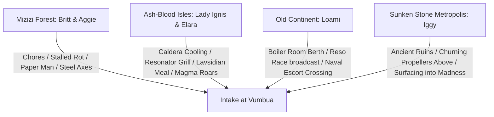

# Handoff: Campaign Lore, Prologue Architecture & Novel Writing Plan

**Date:** 2026-09-06  
**Branch:** `vumbua`  
**Target Next Agent:** Editorial & Narrative Writing Subagent  
**Scope:** Canonical lore integration, 4-perspective prologue architecture, audit toolchain status, and novel pipeline next steps.

---

## 1. Executive Summary & Context

Over the course of recent editorial audits, the novel adaptation of the Vumbua campaign underwent a complete forensic review:
1. **Pacing & Bloat Audits:** The novel chapters from Session 1 through Session 12 were pruned of table filler, OOC dice talk, and logistical drag while maintaining 100% parity with raw gameplay ledgers (`verify_parity.py`).
2. **Atmospheric Setup & Grounding:** Early chapters were audited to ground physical character descriptions (Britt, Aggie, Loami, Ignatius, Iggy) and setting details (1920s Ellis Island / World's Fair style quays at the intake, rather than revealing late-game secrets too early).
3. **EPUB Packaging:** A standalone generator (`novel/generate_epub.py`) produces both an Illustrated edition (with portrait frontmatter map) and a Text-Only edition (optimized for ElevenLabs TTS and e-readers).
4. **The Prologue Re-Evaluation:** The previous prologue was flagged for ping-ponging between the Mizizi and macro-history, suffering from *Mortal Engines* steampunk drift, and leaking late-game lore (such as the dying Global Amplitude). The user has directed a complete re-anchor into **four distinct character-origin perspectives** that establish canonical lore and immediate emotional stakes before Chapter 1.

---

## 2. Updated Campaign Lore & Canon Directives

The following lore updates have been committed to the campaign files (`campaign/factions/clans/ash-bloods.md`, `campaign/locations/ash-blood-isles.md`, `campaign/characters/npcs/lady-ignis.md`):

### A. The Twin Expeditions (~24 Months Ago)
- **Valentine Sterling Sr.** and **Captain Elara Thorne** were rival exploranauts who breached the southern and eastern mists at approximately the same time.
- **Sterling Sr. (The Mizizi):** Cold, clinical, and transactional. He found a turtle-mushroom clan terrified of their stopped rot. He had no answers, traded them steel axes and saws for soil and root samples, and departed quickly.
- **Elara Thorne (The Ash-Bloods):** Empathetic, immersive, and diplomatic. She stayed in the freezing caldera of the Ash-Blood Isles, forming a close personal bond with Matriarch **Lady Ignis**.

### B. The Food & Frequency Connection Ritual
- **Resonators, NOT Batteries:** Elara demonstrated Harmony **resonators** (frequency tuners, not galvanic batteries) to power a portable grill and cook a hot meal inside the freezing volcanic caldera.
- **Lavsidian Across the Sea:** In return, Lady Ignis chiseled a piece of dormant **lavsidian stone** and sent it across the sea to Harmony Prime with explicit instructions to cook an imperial meal with it.
- **The Rekindling:** The moment the connection across the ocean was completed, the ancient resonance sparked: the dead magma roared back to life with volcanic fury, sending Elara scrambling out of the caldera in ecstatic celebration.

### C. Lady Ignis & The Relocation of Vumbua
- Lady Ignis traveled with Elara Thorne to Harmony Prime, taking a sovereign seat under the **Inverse Power Doctrine** (*"the newest integrated member holds voting power equal to the entire government on frontier policy"*).
- Her very first legislative act was signing the Expansion Bill that officially authorized the physical relocation of **Vumbua Academy** across the ocean to the southern basin.

### D. The Resonance Races & The Apex Arena
- On the old continent, the Resonance Races—Harmony’s premier national sport—had grown stale and unpopular on flat, open-ocean straightaways.
- The arrival of Lady Ignis and the opening of the frontier generated explosive public hype for a daring new raceway to be carved into the vertical basalt cliffs of the new world: **The Apex Arena**.

### E. The Convoy Crossing & Sunken Ruins
- Vumbua's crossing was a massive naval migration: the Deep-Hull and Sky-Spires were escorted by ironclads firing heavy guns into the fog to drive off prowling aether beasts.
- Beneath the destination harbor basin lies an ancient, submerged stone metropolis (an abyssal, stone Atlantis equivalent) where the subterranean trench-kin lived unaware of the surface world until the churning propellers of Vumbua arrived overhead.

---

## 3. The 4-Perspective Origin Architecture

The opening scenes must be executed from these four distinct points of view before the exam doors open in Chapter 1:



### Scene 1: The Mizizi — Britt & Aggie (*The Stalled Rot*)
- **Setting:** Deep hollows of the petrified megaflora.
- **Inciting Horror:** Britt and Aggie doing routine chores along the spore shelves. A fallen ironwood bole fails to decompose. The rot has stalled. In their folklore: *“When things stop dying, we start dying.”* Panic sweeps the canopy.
- **The Paper Man:** Sterling Sr. arrives, looking like clean-minted paper with zero dirt or moss. Speaks an archaic dialect remarkably close to their own. Gives no answers about the stalled rot, but offers iron axes and saws to "take matters into your own hands."
- **The Tragic Trade:** The clan frantically hacks into their own trees trying to force the rot to resume.
- **The Spark:** News arrives of a city appearing overnight with an academy. Ancient lore of the **Exchange** (where one outsider is sent/received every few cycles to sustain bloodlines) proved other clans existed, but they never knew one lived so close. Britt and Aggie step forward to find out what broke the natural order.

### Scene 2: The Ash-Bloods — Lady Ignis & Elara Thorne (*The Rekindled Hearth*)
- **Setting:** Inner caldera of the Ash-Blood Isles.
- **The Cooling:** The volcanic lakes have hardened into black glass; geysers blow cold mud; the clan's obsidian skin is dulling.
- **The Connection:** Elara Thorne stays and shares food. She powers a grill with a Harmony resonator inside the caldera; Lady Ignis sends a lavsidian stone to Harmony Prime to sear a meal in the capital.
- **The Roar:** The connection triggers a volcanic resurgence—molten lava detonates from the vents, forcing Elara to scramble out in laughter and awe.
- **The Sovereign Seat:** Ignis travels to Harmony Prime, takes her sovereign seat, and signs the decree that unmoors Vumbua and sends it south.

### Scene 3: The Old Continent — Loami (*The Gospel of Steam*)
- **Setting:** Boiler rooms of Vumbua while still docked at the old continent.
- **The Berth:** Loami hears the telegraphs about the double clan discovery. As a fifth-generation boilermaker apprentice, he knows the city must move, guaranteeing him a crossing berth.
- **The Sports Culture:** Catching radio broadcasts of the Reso Races—the dull ocean courses losing viewership, contrasted with the wildfire hype for the new basalt canyon raceway (Apex Arena).
- **The Treacherous Crossing:** The convoy steams south: Deep-Hull, Sky-Spires, and ironclads fending off aether beasts in the churning grey swells.

### Scene 4: The Deep Ruins — Iggy (*The Surface Breach*)
- **Setting:** Sunken stone metropolis beneath the basin.
- **The Deep Life:** Iggy scurrying through ancient submerged masonry, copper goggles oiled, tinkering with brass scrap under comfortable abyssal pressure.
- **The Churn:** A sound never heard in centuries: titanic propellers, ballast groans, and dropping anchor chains boiling the water overhead.
- **The Emergence:** Iggy sneaks up through an underwater thermal conduit, popping out under the barnacled quays on intake day. The open sky and harsh sun begin desiccating his clay frame—until a grizzled dockworker drops a heavy, greasy wool trench coat over him, giving him the crushing pressure he needs to waddle into the testing lines.

---

## 4. Audit & Verification Toolchain

Always use the following automated test suite before and after making novel changes:

### A. Parity & Ledger Integrity
```powershell
python sessions/_scripts/verify_parity.py s1
```
* **Rule:** Confirms 100% transcript coverage and that no spoken dialogue from the raw ledger is lost or dropped. Must report `[PASS]`.

### B. Prose Quality & Bloat Audit
```powershell
python .agents/skills/novel-critic/scripts/critique_prose.py s1
```
* **Rule:** Scans for stagnant talking heads, dialogue-to-action balance, sensory overkill, and logistical filler. Aim for a **LEAN & DYNAMIC** editorial verdict.

### C. EPUB Compilation & Verification
```powershell
python novel/generate_epub.py
```
* **Output:**
  - `novel/vumbua-momentum-is-life-illustrated.epub` (includes portrait Harmony map frontmatter)
  - `novel/vumbua-momentum-is-life-text-only.epub` (clean text for TTS readers)
* **Rule:** Validates XHTML structure, nav document, NCX TOC, and CSS typography.

---

## 5. Next Steps for Incoming Agent

1. **Implement the 4-Perspective Prologue:**
   - Review draft in `novel/sessions/s0-story.md` and `sessions/data/clean/s1-clean-story.md`.
   - Update `s1-clean-story.md` (lines 15–33) or integrate `s0-story.md` as an official Chapter 0 / Prologue sequence in `generate_epub.py`.
   - Ensure the four perspectives hit all sensory and thematic beats without leaking late-game lore (no dying Global Amplitude, no 6-clan circuit mentions).
2. **Run the Audit Suite:**
   - Execute `verify_parity.py s1` and `critique_prose.py s1`.
   - Re-run `python novel/generate_epub.py` to confirm clean EPUB builds.
3. **Commit & Iterate:**
   - Check status and maintain clean git history on `vumbua`.
