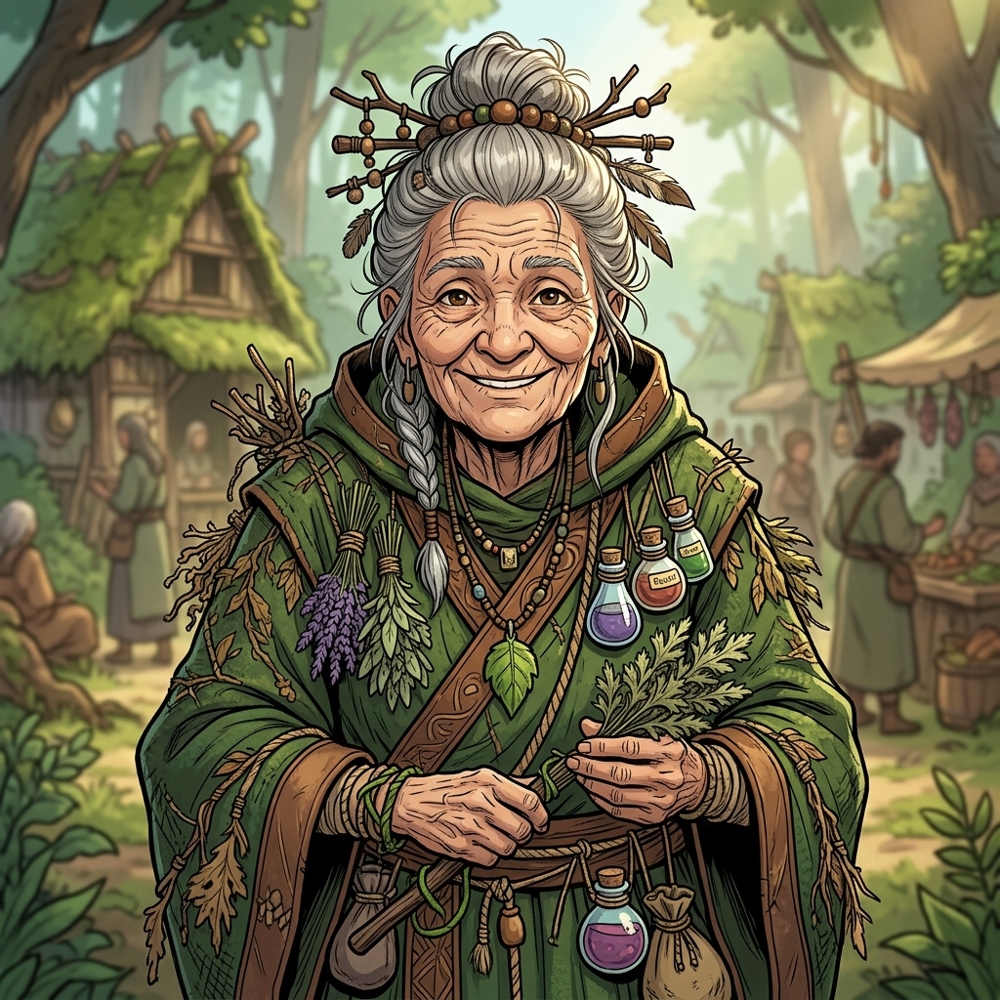

---
tags:
  - notable-figure
  - npc
  - mizizi
  - elder
aliases:
  - Angela Galaspora
  - Angela
  - Great Aunt Angela
  - Aunt Angela
---

# Angela Galaspora

> *"We're going on an airship."*

| | |
|---|---|
| **Role** | [[Mizizi]] Clan Elder |
| **Affiliation** | [[Mizizi]] |
| **Status** | Active |
| **First Appearance** | [[s7-clean\|Session 7]] |

## Description

Angela Galaspora is a Mizizi clan elder and Aggie's great-aunt. Described as eccentric and socially liberal for a Mizizi — somewhere between Angela from Eragon and Professor Trelawney from Harry Potter. She is laden with herbs, potions, and pockets of ingredients, chattering constantly and introducing herself freely.

She is one of the few Mizizi elders willing to engage socially with other clans, making her the natural choice to represent the Mizizi at public events like the Reszo Race.

## Session History

### Session 7: Race Day
- Arrived at Aggie and Britt's dorm to take them to the Zephyr for the Reszo Race (established in pre-session conversation between GM and Aggie's player).
- Boarded the Zephyr early and was introduced to [[Valentine Sterling Sr.]] and [[Cade Ashveil]] on the VIP deck. Cade attempted to facilitate diplomatic conversation between Angela and Sterling Senior, but Senior was focused on the race.
- Pulled Aggie and Britt aside for a private conversation during the race, agreeing to continue it over breakfast the next morning.
- Identified by [[Cade Ashveil]] on the Zephyr as "Angela — she's from the Mizizi clan."

> [!NOTE]
> Angela's full on-screen interactions were established in a pre-session side conversation between the GM and Kristina (Aggie's player), not in the main session. Her presence was confirmed in-session by Cade's reference to her and by Iggy spotting her boarding with Aggie and Britt.

## Relationships

- **[[Aggie]]** — Her great-niece. Protective of her.
- **[[Britt]]** — Aggie's companion. Angela brought both girls to the Zephyr.
- **[[Valentine Sterling Sr.]]** — Met on the Zephyr. He showed more interest in the race than in conversation.
- **[[Cade Ashveil]]** — The Ash-Blood ambassador attempted to connect her with the Sterlings as part of Lady Ignis's diplomatic strategy.

## GM Session Plan Context

> [!WARNING]
> The following information comes from the GM's session plan (`s7-plan.md`) and has NOT been fully verified in-session. It is included here as reference but should be treated as suspect until confirmed through gameplay.

- The session plan describes her as "Great Aunt Angela Galaspora (Mizizi Clan Elder)" who was "present when Valentine Senior first 'established contact' with the Mycelium Forest."
- She "knows Senior only cares about what he can discover and catalog" and "suspects Harmony's 'resonance pruning' is slowly killing their home."
- A "Connections Prompt" in the plan would have Aggie roll to recall a shared secret or asset; success grants a "Mizizi Spore Pod." This did NOT occur in the session transcript.
