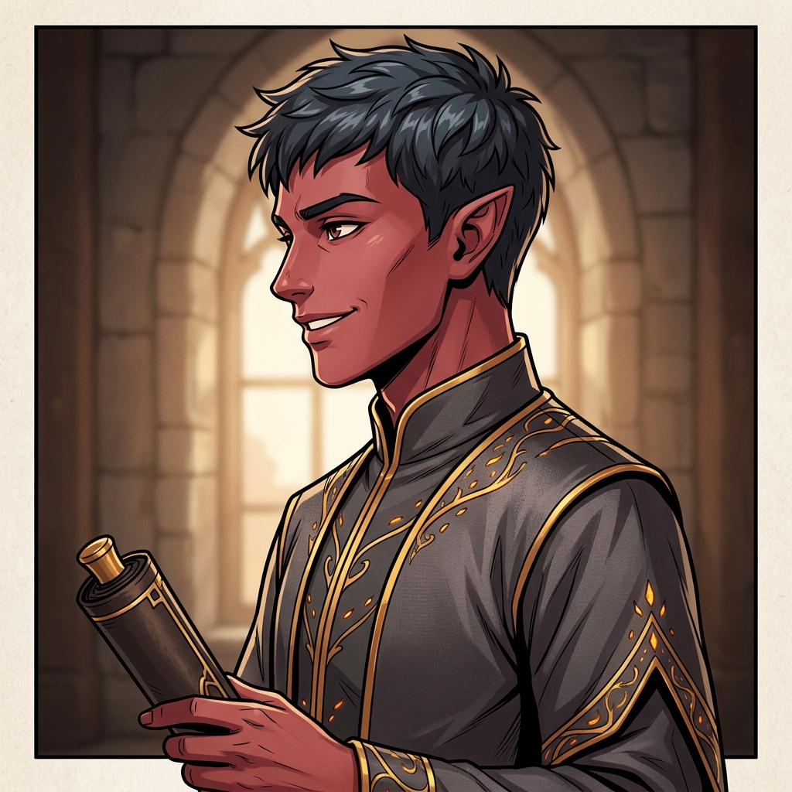

---
tags:
  - notable-figure
  - npc
  - ash-blood
  - diplomat
aliases:
  - Cade Ashveil
  - Cade
  - Kade
---

# Cade Ashveil

> *"I don't know about you, but I'm not going back to a cold volcano."*

| | |
|---|---|
| **Role** | [[Ash-Bloods\|Ash-Blood]] Ambassador to [[Vumbua Academy\|Vumbua]] |
| **Affiliation** | [[Ash-Bloods]], [[Lady Ignis]] |
| **Status** | Active |
| **First Appearance** | [[s7-clean\|Session 7]] |

## Description

Cade Ashveil is Lady Ignis's newly appointed ambassador to Vumbua. He is a smooth, charismatic diplomat — formerly a small-town politician from the Ash-Blood Isles — now thrust into a high-stakes role fostering clan-Harmony relations. He has been in the ambassador position for approximately three days as of Session 7.

ignatious recognized him from the "pre-Harmony days" on the Ash-Blood Isles, describing him as "not really a big shot, but kind of a big-shot small-town politician." His manner is approachable and earnest, with a tendency to over-explain his diplomatic role before catching himself.

## Session History

### Session 7: Race Day
- Encountered on the Zephyr's promenade deck alongside [[Ember]], who serves as his campus liaison.
- Introduced himself to ignatious and explained his diplomatic mission: Lady Ignis wants to establish the Ash-Bloods as a long-term Harmony faction.
- Revealed the Ash-Bloods' core political problem: their node isn't registering as a "major node" despite expectations, preventing the debut of the Ash-Blood spire at the Reszo Race.
- Requested ignatious's help connecting the [[Mizizi]] with the [[Valentine Sterling Sr.\|Sterling family]], as Lady Ignis believes improving Mizizi relations will strengthen the Ash-Blood position.
- Exchanged a reciprocal favor agreement with ignatious — "Ash-Blood helping Ash-Blood."
- Explained that Harmony integration preserves cultures rather than consuming them, citing the Nstyl silence node as an example.
- Shared the Ash-Blood perspective on the "first contact" problem: Sterling Senior's initial approach to the Mizizi was exploitative ("said thanks, spied, and sent reinforcements"), and Lady Ignis believes fixing this could help Mizizi integration.
- Admitted that the Ash-Blood Isles' old isolationist stance ("Ash-Bloods first, no other isles, no contact") is something they're learning to unlearn.

## Relationships

- **[[Lady Ignis]]** — His superior. Sent him to Vumbua as her ambassador.
- **[[Ember]]** — Serves as his campus liaison at Vumbua Academy.
- **[[ignatious]]** — Pre-existing acquaintance from the Ash-Blood Isles. Reconnected on the Zephyr. Struck a mutual favor agreement.
- **[[Angela Galaspora]]** — Was introduced to her on the Zephyr as part of the Mizizi diplomatic outreach.
- **[[Valentine Sterling Sr.]]** — Met during the Zephyr race event; Sterling Senior showed more interest in the race than in diplomatic conversation.

## Notable Quotes

> *"I've been Lady Ignis's ambassador back to Vumbua for approximately three days now."*

> *"As the Ash-Bloods, we want to take advantage of the opportunity to establish ourselves as a long-term faction in Harmony. It's not going anywhere. It's been good for the clan."*

> *"All we've been told is: Ash-Bloods first, no other isles, no contact. And Harmony is the exact opposite — they seem to require new people and new cultures."*

> *"Our fire influences our culture just as much as that sand. Why is it not having the same impact?"*
