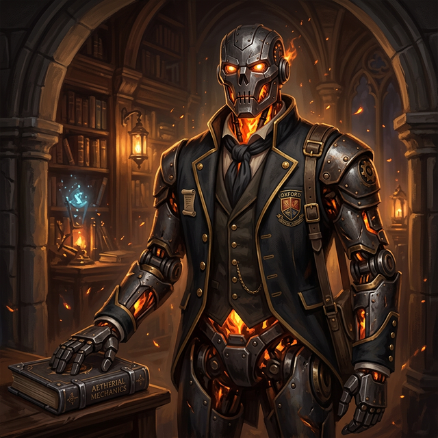

---
aliases:
  - "Cinder"
tags:
  - first-year
  - npc
  - ash-blood
  - squad-07
---

# Cinder-4

**Role:** Student Candidate / Squad 06 (Prospective)
**Affiliation:** [[Vumbua Academy]], [[Ash-Bloods|Ash-Blood]] / Construct
**Status:** Active

## Overview
Student candidate of prospective Squad 06, "The Kiln." A Warforged/Construct powered by an internal flame, possibly Ash-Blood technology.

## Personality
- Fiery temperament but mechanically precise.
- **Voice:** Like a furnace door opening.

## Related Pages

- [[Hearth]] — Squad 06 Support
- [[Kindle]] — Squad 06 Striker
- [[Ash-Bloods]] — Clan technology connection
- [[Vumbua Academy]] — Current posting
