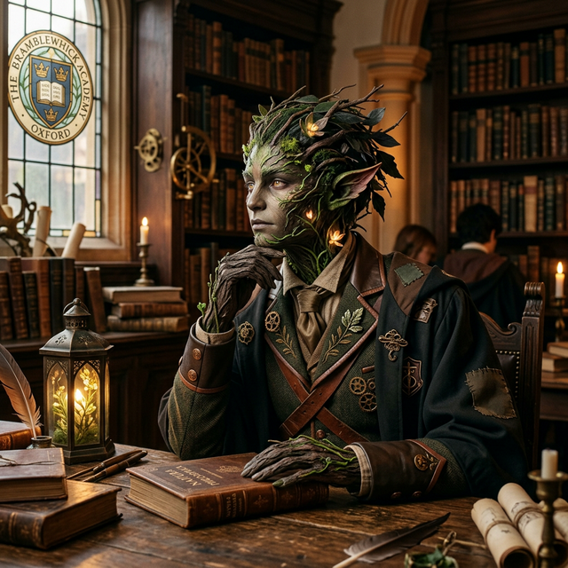

---
aliases:
  - Cyclops
  - Sam
  - Cyclops Sam
  - Sector 4 Cyclops
tags:
  - first-year
  - npc
  - squad-03
  - student
canon: transcript
reveal: player
---

# Sam the Cyclops

> *"Hey, hey, hey! What are you doing? I got the best crystals! I did not make a mistake! Your crystals, my crystals!"*

## Overview

| | |
|---|---|
| **Role** | Student Candidate / Squad 03 (The Scholars) - Vanguard Heavy |
| **Race** | Cyclops-Kin / Giant-Kin |
| **Affiliation** | [[Vumbua Academy]], [[squads\|Squad 03]] |
| **Status** | Active |
| **First Appearance** | [[s9-clean\|Session 9]] |

## Description
Sam is a massive 18-foot-tall Cyclops candidate with a single large glowing eye, immense physical reach, and a booming voice. Despite his imposing physical presence, Sam is serious about academic candidacy and crystal harvesting, fiercely protecting his squad's resource haul.

## Session Appearances

### Session 9
- **The Steam Vent Spa & Sulfur Harvest:** Gathered high-purity sulfur crystals in Sector 4. Encountered [[Iggy]], who tried to negotiate for his large crystals. When Sam refused to trade (*"I don't negotiate! Your crystals, my crystals!"*), Iggy bit Sam's massive hand and stole a raw crystal using *Mud Lash*.

### Session 10
- **The Forest Pursuit:** Chased Iggy alongside **[[Serra Vox|Serra Vox]]** across Sector 1 and Sector 3 to recover the stolen crystal.
- **The Tree Hurl:** Trapped Iggy with his massive hand before Iggy slipped away in ball form. In frustration, Sam hurled a 20-foot petrified tree trunk like a javelin at Iggy, dealing heavy impact damage and instilling in Iggy a permanent traumatic phobia of trees.
- **Squad 03 Alignment:** Operates as the physical vanguard for **Serra Vox**'s squad (Squad 03).

## Relationships
| Character | Relationship |
|-----------|-------------|
| **[[Serra Vox]]** | Squadmate in Squad 03. Pursued Iggy alongside her in Sector 3. |
| **[[Percival Vane-Smythe III]]** | Squadmate in Squad 03. Sam provides the heavy physical muscle to protect Percy's academic research. |
| **[[Sarge]]** | Fellow heavy/handler in Squad 03. |
| **[[Iggy]]** | Bitter rival. Iggy bit his hand in Sector 4 and stole his crystals; Sam threw a tree trunk at him in retaliation. |
