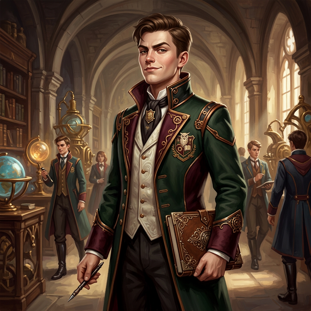

---
aliases:
  - Finch
tags:
  - first-year
  - npc
  - harmony-born
  - student
  - squad-01
canon: transcript
reveal: player
---

# Finch Gable

> *"You forgot to carry the wind-shear coefficient. If you drop it now, the crate lands in the ocean three miles south, and we all starve. Move your decimal."*

## Overview

| | |
|---|---|
| **Origin** | Harmony (Capital Region) |
| **Rank** | Copper |
| **Affiliation** | [[Vumbua Academy]], Logistics / Syndicate of Sails |
| **First Appearance** | [[session-04|Session 4]] |

## GM Description
Finch is a lanky, perpetual-motion machine of a student. He's Harmony-born, raised in the logistics hubs of the Syndicate of Sails. His hands are always stained with ink or grease, and he constantly spins a brass stylus between his fingers. He wears a heavily modified Academy uniform with extra pockets sewn in for calipers, slidesticks, and crumpled supply manifests.

## Personality
- **Hyper-Competent Math Nerd:** To Finch, the universe is just a series of equations waiting to be solved. He genuinely enjoys the brutal calculations required for *Aetheric Ballistics & Logistics*.
- **Snobbish and Elitist:** Finch believes he is intellectually superior to those who don't grasp the math immediately. He has little patience for working-class students who rely on "practical" knowledge.
- **Unintentionally Annoying:** He will aggressively correct other people's math over their shoulders or make condescending remarks. He doesn't do it just to be mean; he physically cannot stand to see a wrong answer or be associated with "ignoramus" behavior.
- **Stress Eater:** When the exams get tough, he chews on the ends of his styluses or stress-eats Nutri-Paste.

## Background
Finch comes from a family of loadmasters and quartermasters within the Syndicate of Sails. He spent his childhood calculating load balances for merchant airships. To him, the Academy's "No-Win" logistics scenarios aren't theoretical — they resemble the dinner table arguments his parents used to have about shipping margins. 

He ended up sitting next to [[loami]] during the brutal first-week *Aetheric Ballistics & Logistics* class. Where others struggle with the crushing weight of the calculations, Finch thrives. Instead of helping, Finch refused to let Loami copy his notes, citing that he didn't want to get "chalk dust" on himself from Loami's friends. This establishes him as an early academic rival.

## Session Appearances
### Session 4
- Sits next to [[loami]] during the first-week montage in the *Aetheric Ballistics & Logistics* lecture.
- Rebuffs Loami's attempt to copy his notes after ignatious is hit in the head with chalk. Promises to sit in a different row tomorrow to avoid them.

### Session 6
- **The Alleyway Trade:** Spotted by [[Britt]] in a side alley outside the city, whispering to an Indigo Turban enforcer. Finch tried to trade information/secrets about [[Valerius Sterling]] in exchange for access to the hangar bay so he could spy on what the second-years are building for the Reso Race.

## Relationships
| Character | Relationship |
|-----------|-------------|
| **[[loami]]** | A one-sided academic rival. Loami tried to get notes from him, but Finch brutally rejected him, calling him out for associating with "ignoramuses." |
| **Instructor Hallow** | Finch considers Hallow's complex atmospheric math problems to be "light puzzles." Hallow likely finds him both a star pupil and incredibly irritating. |

---

## GM Secrets

> [!warning]-
> The following information has been narrated by the GM but is not known to the player characters.

- **The Hangar Infiltration & Class Theory:** Finch was desperate to test a logistics/aerodynamics theory he had formulated in class, which required measuring a second-year rig. This was his sole motivation for attempting to infiltrate the hangar.
- **The Trade with Valerius's Agent:** Finch discovered that the replacement node (the Harmony-compatible core) for Valerius's backed team (**Shatter Stamper**) was confiscated by Warden Rovaldi because of a late spec-change submission. Knowing that Valerius (and Ember, who is pushing Valerius to act) has no idea their rig is compromised, Finch used this secret to strike a deal. He didn't talk to a random guard; he whispered to one of **Valerius's reporters/enforcers** (who works for Valerius's radio show/club while pulling duty as an Indigo Turban enforcer), offering the news of the confiscated node in exchange for access to the **observer balloon**, where he could watch the race more clearly to test his logistics and wind-shear theories.
- **Pattern Recognition:** Finch isn't just good at math — he's good at noticing patterns. If he survives the cut, he's the kind of character who might calculate that the Academy's supply consumption doesn't match its publicly stated population, hinting at the existence of the deep-hull vaults or other secret projects.
