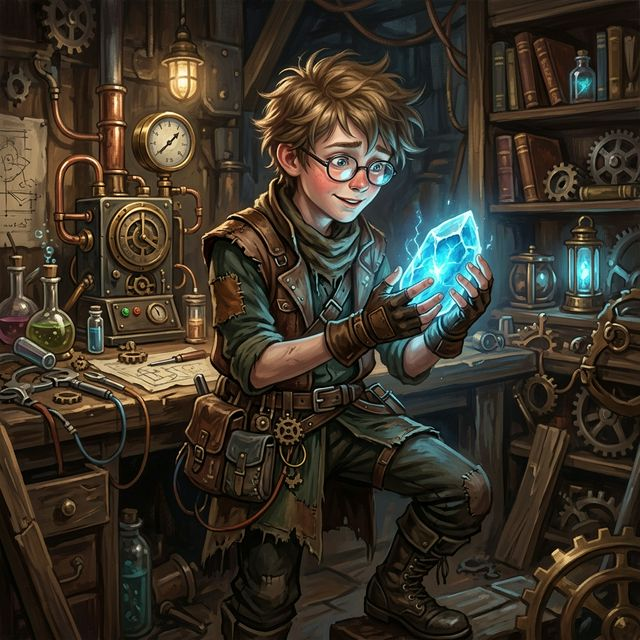

---
tags:
  - first-year
  - npc
  - student
  - squad-06
---

# Kael

| | |
|---|---|
| **Role** | Student / Inventor |
| **Race** | Human (assumed) |
| **Affiliation** | [[Vumbua Academy]] |
| **Status** | Active |
| **First Appearance** | [[s4.5-clean\|Session 4.5]] |

## Overview
Kael is a shy, frail, nerdy boy with a brilliant mind for Harmony Tech. The rest of his newfound friend group follows him around because he is, in their words, "the smartest of all of us." He is currently working on an independent project to turn ordinary stones into bidirectional "Speaking Stones."

## Session Appearances

### Session 4.5
- **Speaking Stones:** Explained his theoretical "Speaking Stones" to [[Brit]], detailing how they run on "resonance" (the river of energy) and require Umber Crystals to safely restrict power flow.
- **The Chase:** Struggled to keep up during the chase after [[Silas Thorne|Professor Thorne]] until [[Bramble]] dragged him along.
- **Radio Test:** Lent [[Aggie]] a semi-functional prototype stone to test communication during the day.

## Relationships
- **[[Pip]], [[Bramble]], [[Saffron]]:** His newfound friend group who latch onto his intelligence.
