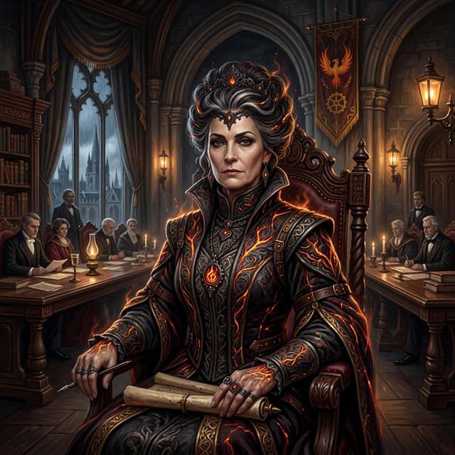

---
aliases:
- Ignis
- Lady Ignis
tags:
  - notable-figure
- npc
- ash-blood
- harmony-council
---

# Lady Ignis

| | |
|---|---|
| **Role** | [[Ash-Bloods\|Ash-Blood]] Matriarch / Harmony's Highest Voting Power |
| **Affiliation** | [[Ash-Bloods]], Harmony Council |
| **Location** | [[Harmony Prime]] (High Council) |
| **Status** | Active |
| **First Mentioned** | [[session-02\|Session 2]] |

## Overview
The leader of the Ash-Blood clan who integrated with Harmony. Under the **Inverse Power Doctrine**, she currently holds the **highest voting power** in all of Harmony---essentially the "President"---because the [[Ash-Bloods]] are the newest formally integrated member.

## The Inverse Power Doctrine
Harmony grants the newest integrated member the highest voting power to prevent exploitation. *"The least of us should become the most of us."* This ensures that the people who live in newly integrated lands make decisions about their own resources. It's kept the peace for a thousand years.

Lady Ignis holds this position because the [[Ash-Bloods]] were the most recent full integration (~24 months ago).

## Integration & The Connection Ritual
When Captain Elara Thorne breached the eastern sea mists, she met Lady Ignis during the depth of "The Great Cooling." Unlike Valentine Sterling Sr., who made a brief transactional trade with the Mizizi, Thorne stayed. She demonstrated Harmony resonators powering a grill to cook a meal in the freezing caldera, and Lady Ignis sent a dormant lavsidian stone back across the sea to cook a meal in Harmony Prime. When the mutual connection bridged, the volcano roared back to life.

Lady Ignis traveled with Thorne to Harmony Prime, taking her sovereign seat under the Inverse Power Doctrine. Her very first act of state was to officially authorize the Expansion Bill, relocating [[Vumbua Academy]] to the southern frontier.

## Personality
- **Pragmatic, Regnal:** Takes the long view. She knows the [[Ash-Bloods]] were "cooling" and dying out; Harmony offered survival.
- **Conflict:** Viewed with suspicion by traditionalists (like [[ignatious]]) but commands immense respect.
- **Diplomatic Vision:** Uses her envoy [[Cade Ashveil]] to help the [[Mizizi]] integrate, understanding that strengthening the frontier clans solidifies the Ash-Bloods' standing in Harmony.

## Source References

- **[[session-02|Session 2]]** — [[Serra Vox]] explained the [[Inverse Power Doctrine]] and Lady Ignis's role to [[ignatious]] *(Scene 6: Ash-Blood Politics)*
- **[[session-02|Session 2]]** — [[ignatious]] witnessed Lady Ignis rise to prominence during the Integration ceremony *(background lore)*
