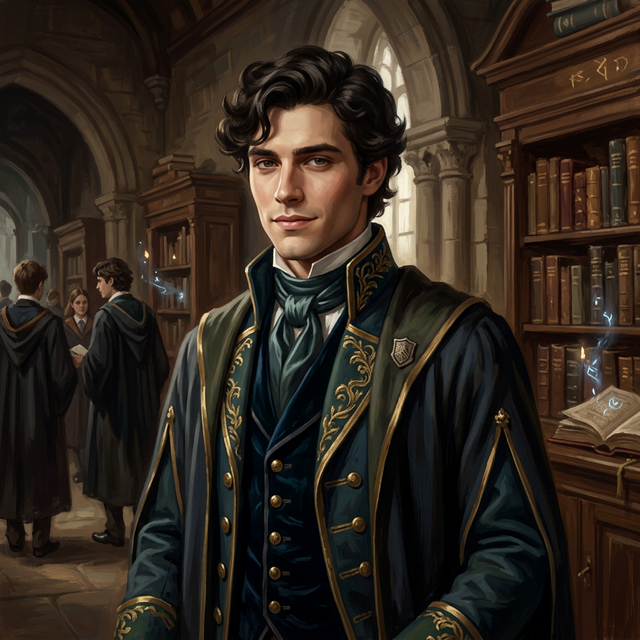

---
tags:
  - first-year
  - npc
  - squad-04
---

# Lance

| | |
|---|---|
| **Role** | Student (Harmony Native) |
| **Affiliation** | [[Vumbua Academy]], Harmony |
| **Status** | Active |
| **First Appearance** | [[session-01\|Session 1]] |

## Overview
A Harmony native student, described as "Bridgerton-esque." He greeted [[ignatious]] cordially but with the somewhat condescending politeness of the upper class.

## Personality
- **Charming, Polished:** Represents the idealized, if slightly vapid, face of Harmony youth.
- **Social:** Likely knows all the gossip and social hierarchies.

## Source References

- **[[session-01|Session 1]]** — Greeted [[ignatious]] cordially after the intake exam; recognized him as an [[Ash-Bloods|Ash-Blood]] *(Scene 8: The Punch Cards)*
