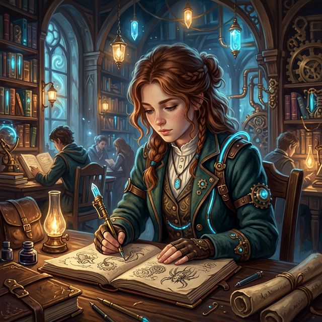

---
tags:
  - first-year
  - npc
  - student
  - squad-06
---

# Saffron

| | |
|---|---|
| **Role** | Student / Sketch Artist |
| **Race** | Human (assumed) |
| **Affiliation** | [[Vumbua Academy]] |
| **Status** | Active |
| **First Appearance** | [[s4.5-clean\|Session 4.5]] |

## Overview
Saffron is a quiet, ethereal student who exists primarily in her own world, sketching whatever catches her eye. She rarely speaks and is content to follow the energetic wake of her friends. 

## Session Appearances

### Session 4.5
- **The Artist:** Spent the morning and classes sketching in her notebook, including a drawing of the large airship in the courtyard and [[Bramble]] holding the door.
- **The Chase:** Was the only member of the group who didn't chase after [[Silas Thorne|Professor Thorne]], as she was too engrossed in her drawing.

## Relationships
- **[[Pip]], [[Bramble]], [[Kael]]:** Her friends who welcomed her to the group when they saw her drawing the hangar before exams.
