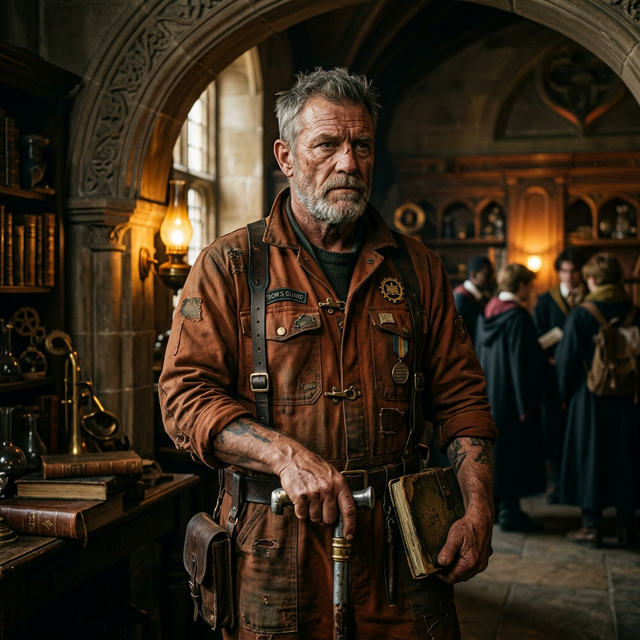

---
tags:
  - first-year
  - npc
  - rust-rank
  - squad-03
---

# Sarge

| | |
|---|---|
| **Role** | Student Candidate (Rust Rank) / Squad 09 (Prospective) |
| **Affiliation** | [[Vumbua Academy]], "The Engine Room" |
| **Location** | [[Block 99]] area |
| **Status** | Active |
| **Archetype** | The Safety Inspector |
| **First Appearance** | [[session-01\|Session 1]] |

## Overview
"Sarge" is a Rust-tier veteran, likely an older student or a TA/Worker who keeps getting pulled into squads to keep them alive. He works in the boiler rooms with [[loami]]---they know each other from the workers' campfire social hours.

## Session Appearances

### Session 1
- Recognized [[loami]] coming out of the exams: *"Loaves? Loaves, we made it. Can you believe it?"*
- Admitted he barely passed: *"I just looked at the typewriter. Seems about right."*
- Overwhelmed but doing it "for the lads"

### Session 2
- At the Block 99 bonfire, leaning against a wall watching [[Lucky]] sell Engine Grease, kicking empty bottles disapprovingly

### Session 5
- Present in [[Lucky]]'s warehouse during the "interrogation" of the party
- Has a bruised chin from an earlier "pop" caused by one of [[Iggy]]'s clockwork inventions

## Personality
- **Not Bitter, Protective:** He isn't bitter about his station; he's protective. He warns [[ignatious]] about his fire because he's seen unchecked energy kill good people.
- **Goal:** Wants his squad to survive the physics of the world, avoiding the politics.
- Disapproves of [[Lucky]]'s hustling but doesn't intervene directly

## Source References

- **[[session-01|Session 1]]** — Recognized [[loami]] after the exams: *"Loaves? Loaves, we made it"* *(Scene 8: The Punch Cards)*
- **[[session-02|Session 2]]** — Leaning against a wall at the [[Block 99]] bonfire, watching [[Lucky]] disapprovingly *(Scene 8: Grinder Talk)*

---

## GM Secrets

> [!warning]-
> The following information is not known to the player characters.

### Backstory
A former grunt who watched his entire crew die on **The Tempest** when it was pushed too hard and destroyed by an **Aether beast**. The ship belonged to **Iron Hide**, who was the only other survivor alongside Sarge. While Sarge withdrew out of survivor's guilt, Iron Hide turned his grief into extreme aggression, becoming obsessed with hunting and destroying them.

### Bond
His current "Expendable" squad, for whom he feels a crushing, quiet responsibility. He also feels a deep, enduring obligation to protect [[Lucky]], as he was present during the exploration accident on **The Tempest** that killed Lucky's parents. Early on, Sarge was a poor mentor to Lucky, teaching him only survival and rule-bending, which shaped Lucky into a street urchin.

### Flaw
Deep Distrust of Command. He struggles to follow orders from "Golden" officers who haven't bled.

### Motive
To finally graduate and lead his own crew so he can stop idiots from getting good soldiers killed.
