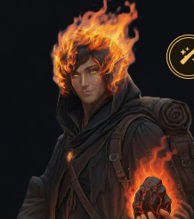

---
aliases:
  - "Lava Boy"
  - "ignatious Magmatoa"
  - "Ignatius"
  - "Ignatius Magmatoa"
tags:
  - pc
  - ash-blood
  - silver-rank
---

# ignatious Magmatoa

> *"Why did all the elders leave?"*

![[Pasted image 20260709171552.png]]
## Overview

| | |
|---|---|
| **Clan** | [[Ash-Bloods]] |
| **Rank** | Silver |
| **Class** | Daggerheart Character |
| **Player** | John |
| **Housing** | [[Block 12]] (with [[Iggy]]) |

## Appearance

An [[Ember]] Islander with **literal flames** for hair. Fire is a natural part of his being, forming a burning orange crown around his head of dark hair. He has warm, glowing yellow-orange eyes, wears a dark hooded traveler's cloak, and is soot-dusted from his travels. He is often seen carrying a piece of warm, glowing molten volcanic stone (lavsidian) in his hands.

## Personality

ignatious carries a **facade of confidence** that can melt away when confronted with the overwhelming reality of Harmony's scale — his first roll was a fear roll as he processed the sheer size of Vumbua. He's politically minded for a teenager: passionate about his clan's independence but without full understanding of how the world works. He's idealistic in the way that someone who hasn't been tested yet can be.

**Key Traits:**
- Idealistic about [[Ash-Bloods|Ash Blood]] independence — wants partnership, not subservience
- Culturally proud — deeply tied to the Ash-Blood clan's traditions and volcanic heritage
- "Classic teenager with strong political ideals who doesn't really know how the world works"
- Traditionalist — annoyed at [[Ember]]'s modernizer stance, believes in the old fire
- Confident facade that cracks under pressure — then rebuilds quickly
- Named the fuel rocks "[[lavsidian]]" himself (lava + obsidian combined)
- Has a hot temper — literally and figuratively (lit the bonfire prematurely out of instinct)
- Funny without always meaning to be — the "Lava Boy" exchange was earnest on his end

## Background

From the [[Ash-Blood Isles|Ember Isles]], ignatious witnessed the integration ceremony that brought the [[Ash-Bloods|Ash Bloods]] into Harmony as full citizens. He watched as [[Lady Ignis]] — his clan's matriarch — rose to sudden prominence. But he views the whole thing with suspicion: Harmony's fuel is "fake stuff," and the clan is trading away its identity for trinkets.

He got in trouble exploring areas he wasn't supposed to be in. The elders banished him to "the trial of adventure" — but ignatious reframed it on his own terms: *"No, this is simply a pilgrimage."* He arrived in Harmony with a backpack on his shoulder, in awe of everything, knowing one thing for certain: he's going to find a new source of heat for the clan and prove that the old ways are right.

### The Integration Ceremony
ignatious attended the **Stitching ceremony** where:
- An obsidian cooking stone and Harmony battery cooked meat side by side
- When they took the first bite, the volcano came alive
- [[Lady Ignis]] gained enormous status and resources (airship, sea vessel, iron walker)
- The [[Ash-Bloods|Ash Bloods]] became quasi-famous in Harmony

### What He Knows
- Lady Ignis is now someone extremely important in Harmony
- The volcano's reaction to the Integration was significant
- Captain Elara Thorne discovered the [[Ash-Bloods|Ash Blood]] islands
- The relationship should be a "partnership" not exploitation
- The fuel his people produce — what he calls [[lavsidian]] — powers the academy's boilers
- Ash-Blood physiology releases heat by burning hotter — it doesn't build up

### What He Questions
- Why did the elders leave?
- Why is this integration such a big deal for Harmony?
- Is the clan being taken advantage of?
- Why is the volcano reheating?

## Skills & Experiences

- **Fire manipulation** — literal flames are part of his being; can light things instantly
- **Heat management** — understands Ash-Blood physiology and how heat release works
- **Volcanic knowledge** — knows about [[lavsidian]] (lava + obsidian), volcanic systems, and the clan's relationship to fire
- **Exploration instinct** — got in trouble for exploring forbidden areas back home; driven to discover
- **Cultural knowledge** — deep understanding of Ash-Blood traditions, the Stitching ceremony, and clan politics

## Inventory

| Item | Source | Notes |
|------|--------|-------|
| Backpack | Personal | Carried from the Ember Isles |
| Hot stone | Ash-Blood tradition | Obsidian cooking stone — a piece of home |

## Quest Tracker

> What ignatious believes his quest to be, based on what's happened in-session.

### Session 0 — The Pilgrimage
ignatious was banished by the elders for exploring forbidden areas, but he reframed it: *"No, this is simply a pilgrimage."* His core quest from the start: find a new source of heat for the clan and prove that the Harmony fuel is fake. *"I'm going to find the new source of heat for the clan and everything's going to go back to the way it should be."* He arrived in Harmony with conviction.

### Session 1 — The Scale of It
The facade of confidence cracked when he saw Vumbua — the massive ships, the construction, the sheer scale. First fear roll of the game. Met Lance, who recognized him instantly ("Was it the soot or the literal flames?"). The handshake test: Lance wanted to know if ignatious's hand would burn him. It didn't. Getting oriented in a world much bigger than the Ember Isles.

### Session 2 — Declaring His Quest
The bonfire was ignatious's moment. He lit it prematurely (instinct, not showing off), panicked Cassius, but it became a great moment when Loami helped smooth things over. Then he stated his quest openly: *"I want to find the heart of the volcano. The next [[lavsidian]] deposit. I want to find out why it's reheating."* He named the fuel rocks himself — lavsidian (lava + obsidian). He's a traditionalist: annoyed at Ember's modernizing, skeptical of Serra Vox's interest. The "Lava Boy" nickname from Zephyr/Rill stuck. His quest is clear and public now.

### Session 4 — The Myth for the Guide
ignatious faced his first academic hurdles in Logistics class, but found that his cultural roots had tangible value. He traded the traditional Ash-Blood Genesis Myth of the Sky and Sea Dragons to Lucky to secure the annotated exam study guide for the group, showing that the stories of the Ember Isles hold power even in the mechanical halls of the Academy.

### Session 5 — Standing Up as Agent
Accompanying Iggy to the high-stakes negotiation with Lucky, ignatious stepped into the role of Iggy's self-appointed "agent." He protected his roommate's naive genius from Lucky's predatory deals, making sure Iggy's clockwork creations were traded fairly for the Reso Race intel and study guide annotations.

### Session 6 — The Hangar Deal
After getting split up from Iggy in Hangar 12, ignatious evaded the guards and was cornered by his cousin Ember. He put his volcanic heritage to practical use by pre-heating the engine block of Team 1's crawler, the **Ironclad** (Shatter Stamper), in exchange for a blank future favor from Ember and Valerius. Working with pilot Alistair "The Rook" Rookwood, ignatious gained insight into the heavy rig's attrition-based design and the political goals of the modernizer Ash Reds.

### Session 7 — Diplomatic Re-alignment & The Engine Room
Ignatious conned his way onto the Zephyr VIP airship with the boys, posing as a delivery crew. He toured the engine room with Val, discovering that the Ash-Blood integration had failed to increase the global amplitude, causing power instability. Later, Ignatious engaged in a deep diplomatic conversation with Lady Ignis's new ambassador, Cade Ashveil. Learning of their political strategy to assist in Mizizi integration to strengthen the Ash-Bloods' standing, Ignatious experienced a major ideological shift—now believing the Ash-Bloods' future lies with Harmony, not isolation.

## Session Appearances

### [[session-00|Session 0]] — Character Creation
- Established as an Ash-Blood from the Ember Isles — covered in soot and literal flames
- Got in trouble exploring forbidden areas; elders banished him to "the trial of adventure"
- Reframed it as a pilgrimage: "No, this is simply a pilgrimage"
- Core quest: find a new source of heat for the clan
- Arrived in Harmony with a backpack, in awe of everything

### [[session-01|Session 1]] — Arrival at [[Vumbua Academy]]
- Arrived at the entrance exam grounds
- Overwhelmed by the scale of Vumbua's ships and construction
- Met **[[Lance]]** (Bridgerton-esque chad) who recognized him as an [[Ash-Bloods|Ash Blood]]
- First fear roll of the game as he processed the massive academy
- The handshake: Lance asked "Will your hand burn me?" — it didn't

### [[session-02|Session 2]] — The Bonfire
- Lit the [[Block 99]] bonfire prematurely, causing [[Cassius Thorne]]'s panic over thermal distribution
- [[loami]] encouraged him with a critical-success roll
- [[Serra Vox]] asked about [[Ash-Bloods|Ash-Blood]] physiology; ignatious explained heat release via burning hotter
- Discussed [[Ash-Bloods|Ash-Blood]] politics with [[Serra Vox]]; learned about the [[Inverse Power Doctrine]] and [[Lady Ignis]]'s role
- Expressed traditionalist views on fire and [[Ember]]'s modernizer rejection
- Named the fuel rocks "[[lavsidian]]" (lava + obsidian)
- Stated his quest: "I want to find the heart of the volcano. The next lavsidian deposit. I want to find out *why* it's reheating."
- Called [[Zephyr]] "Lightning Girl" after her purple lightning bolt; she called him "Lava Boy" via [[Rill]]
- Joined [[loami]] in scouting the [[Apex Ring]] arena layout.

### [[s4-clean|Session 4]] — First Day of Classes
- Attended Aetheric Ballistics & Logistics class; got hit in the head by a piece of thrown chalk.
- Accompanied the group to trade with Lucky, narrating the Ash-Blood Genesis Myth to secure the exam study guide.

### [[s5-clean|Session 5]] — Cards on the Table
- Accompanied [[Iggy]] to [[Lucky]]'s "warehouse" interrogation.
- Acted as **Iggy's self-appointed "agent"** during the negotiation with Lucky, ensuring his roommate didn't get fleeced.
- Scouted the **Apex Ring** with [[loami]], observing the randomized spire deployment boxes and the [[Juxta's Spire]] location.

### [[s6-clean|Session 6]] — Potatoes and Peas
- Infiltrated Hangar 12 with Iggy; evaded guards in the scaffolding after getting separated.
- Rejoined his cousin Ember in the Shatter Stamper crawler bay.
- Struck a deal for a blank future favor from Ember and Valerius.
- Used his Ash-Blood fire to safely pre-warm the engine block of the **Ironclad** (Shatter Stamper) crawler without cracking the valves, earning the approval of captain Alistair "The Rook" Rookwood.
- Discovered the crawler's defensive bottlenecking design and Lady Ignis's backing of the modernizer Ash Reds faction.

### [[s7-clean|Session 7]] — Race Day
- Conned his way onto the Zephyr VIP airship with Loami and Iggy, serving drinks on the promenade deck.
- Toured the engine room with Valentine Sterling Jr., discovering the global amplitude decline and resonator instability.
- Met with Lady Ignis's ambassador, Cade Ashveil, learning of the Ash-Bloods' integration strategy.
- Shifted his ideological perspective, declaring that the Ash-Bloods' future lies with Harmony.
- Returned to the dorms to cram for Friday's exam.

## Relationships

| Character | Relationship |
|-----------|-------------|
| **[[Lady Ignis]]** | Clan matriarch, now a major Harmony figure. ignatious respects her leadership but questions the deal. |
| **[[Lance]]** | A posh Harmony native who approached him after the exam; tested the handshake ([[session-01|Session 1]]) |
| **[[Serra Vox]]** | Explained the [[Inverse Power Doctrine]]; ignatious skeptical of her "ally" persona ([[session-02|Session 2]]) |
| **[[Cassius Thorne]]** | Panicked when ignatious lit the fire prematurely ([[session-02|Session 2]]) |
| **[[Zephyr]]** | Mutual nicknames: "Lava Boy" / "Lightning Girl" ([[session-02|Session 2]]) |
| **[[Rill]]** | Called him "Lava Boy"; manages [[Zephyr]] ([[session-02|Session 2]]) |
| **[[Ember]]** | Childhood cousin; modernizer who rejects traditional fire — ignatious disagrees |
| **[[Britt]]** | Fellow candidate — met at Vumbua |
| **[[Aggie]]** | Fellow candidate — met at Vumbua |
| **[[loami]]** | Fellow candidate — encouraged him at the bonfire; explained the boilers use lavsidian ([[session-02|Session 2]]) |
| **[[Iggy]]** | Fellow candidate and roommate at [[Block 12]] |

