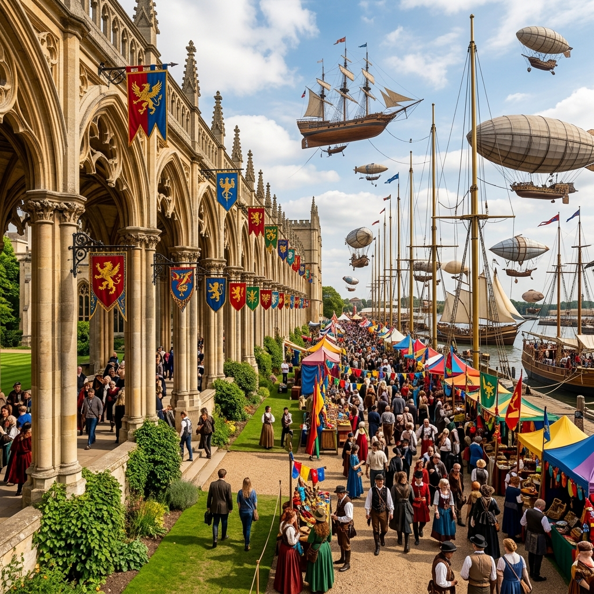
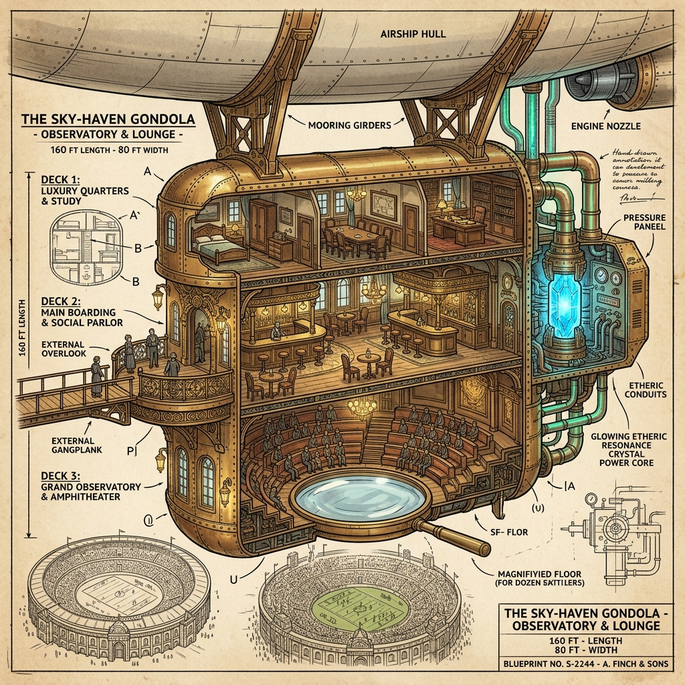

# Session 7 Campaign Plan: The Resonance Race

This document outlines the pacing, NPC encounters, mechanics, and narrative beats for Session 7 of the Vumbua campaign.

---

## 🕒 Phase 0: Individual Opening Check-ins & The Silt-Sled Bridge
Before the first horn blows, ask each player individually:
1. **What time do you arrive at the Apex Ring?** (Early morning prep, mid-day rush, or just before the starting horn?)
2. **What are you trying to accomplish before the race begins?**
   - **Loami:** Setting up the "Ambrosia of Luck" ground stall in the Bleachers with Lucky and Sarge.
   - **Iggy & ignatious:** Deciding if they are trying to escape their own obligations or slip into the pits. (Note: ignatious may test his *Erroneous External Bracing Thesis* if he attempts any last-minute mechanical rigging).
   - **Britt & Aggie:** Heading to the Colonnade early to meet Valentine Sterling.

### 🚛 The Bridge Encounter: "Gear-Oil" Barnaby
If Iggy and ignatious are looking for a way to get from the Block 99 residential/boiler docks to the Apex Ring Gantries/Pits without dealing with security checkpoints or long walks:
- **The NPC:** **Barnaby "Gear-Oil" Cleary**
  - *The Vibe:* A hyperactive, soot-covered student engineer wearing oversized brass welding goggles. He drives the **Silt-Sled**—a rattling, steam-powered cargo flatbed hauler.
  - *The Deal:* He is smuggling a shipment of highly volatile vapor-oil barrels to the pits for Sarge's grog racket. He needs two "cargo guards" to sit on the leaking barrels and keep them steady during transit.
  - *The Hook (The Silt-Sled Ride):* He offers a fast, direct ride straight into the pit lanes (bypassing the outer gates entirely).
  - *The Challenge (Leaky Gaskets):*
    - The passengers must roll **Instinct or Finesse (DC 12)** to keep the valves tight as they rattle over the basalt tracks.
    - *Success:* Arrive directly in Pit Hangar C, gaining **Advantage** on their next stealth or mechanics check in the pits.
    - *Failure:* A gasket blows, spraying hot vapor. Barnaby panic-swerves, and both take 1 Stress as they roll off the sled into the dusty pit gates, arriving with soot-stained faces.

---

## 🏟️ Scene 1: Down in the Stands & The Colonnade

### 🗺️ Colonnade & Entrance Map Layout
This region is the grand, bustling entrance threshold located entirely *outside* the stadium, focusing on the arrival and the sprawling fairgrounds:

1. **The Colonnade Promenade (The Entrance Route)**
   - *The Vibe:* A grand, classical walkway of towering stone pillars lined with ivy, set on Vumbua's green university campus lawns. Large, colorful fabric banners and heraldic flags hang directly from metal brackets on the pillars.
   - *The Stalls:* A highly colorful, sprawling outdoor fair packed with a dense crowd, vibrant merchant stalls, and colorful festival tents.
   - *Banners & Flags:* Flying the sigils of the racing teams (**Shatter Stamper**, **Sail & Stun**, **Marble Wall**, **Pudge**, **Dancer & Fabian**), integrated towns (**Gilded**, **Octo**, **Juxta**, **Relina**, **Settika**, **Nstyl**), and factions (**Ash Reds**, **Mizizi**, **Scriveners**, **House Gilded**).

2. **The Mooring Masts & Docked Airships**
   - *The Vibe:* A forest of multiple slender, elegant brass mooring masts rising into the sky.
   - *The Ships:* A diverse fleet of airships tethered to these masts, showcasing varied designs including sleek needle-thin luxury yachts, wooden flying galleons (sky-clippers) with rigging and sails, blocky industrial cargo barges, and classic oval-hulled zeppelins.

3. **The Basalt Walls & Entrance Gates (Canyon Hidden)**
   - *The Vibe:* The colossal, basalt exterior walls of the stadium rise in the background, completely blocking any view of the inner canyon racetrack from the outside.
   - *The Entrance:* Guarded stone archways serve as the checkpoints. Only after passing through these dark entry tunnels does the ground drop off into the colossal, half-mile-wide natural basin where the spires and track lie.

---

### 2. Britt & Aggie's Colonnade Arrival (Aggie's 10-20 Min Window)
Britt and Aggie arrive at the Colonnade (the pillared sky-bridge where airships tie down) ahead of the rest. Valentine Junior is nowhere to be seen.
- **The Branching Choice:**
  - **Option A: Wait at the Colonnade for Valentine.** Val does not show up. Instead, they are accidentally run into by **Ludo Castellan**, who is rushing past carrying a crate of Sterling blueprints. He stops in irritation upon recognizing them: *"You're Val's 'mushroom friends' from the cafeteria. If you are waiting for him, save your breath. He's been locked in stateroom prep with Lord Sterling Senior since dawn. He isn't allowed visitors until the second bell. Clear out, you're blocking the boarding lanes."*
  - **Option B: Wander the Colonnade & Fairgrounds.** They decide not to wait and instead explore the area, which immediately lets them run into **Great Aunt Angela Galaspora** (Mizizi Clan Elder) or interact with the local vendors.

#### 🛍️ Colonnade Vendors & Fairground Interactions
As the players wander the lawns outside the stadium gates, they can visit these distinct merchant stalls:

1. **The Silent Silt Sign-Merchant (from Nstyl Node)**
   - *The Vibe:* Communicates entirely through hand signs. The stall is completely silent, absorbing ambient festival noise.
   - *Item:* Jars of **Silent Silt** (20 copper).
   - *Interaction:* A PC can attempt to decode their signed names or bargain using signs by rolling **Instinct or Finesse (DC 12)**.
   - *Utility:* Throwing silent silt in a room or on a mechanism absorbs all sound in a 5-foot radius for 1 minute (useful for muting a loud engine repair or sneaking past guards).
2. **The Juxta Lift-Stone Carver**
   - *The Vibe:* An old, grizzled engineer carving weightless miniature shapes.
   - *Item:* **Weightless Lift-Stone Trinkets** (15 copper).
   - *Utility:* Can be attached to a piece of heavy gear or a backpack. Mechanically, it cancels the weight of one heavy item (reducing the load/encumbrance value by 1 or granting +1 to stealth checks involving heavy armor).
3. **The Settika Prism-Water Brew Stall**
   - *The Vibe:* A colorful, steaming beverage bar.
   - *Item:* **Prism-Infused Lemonade** (5 copper).
   - *Interaction:* The drink changes color when touched based on the drinker's current Stress level: Blue/Purple (Calm, 0-1 Stress), Green/Yellow (Anxious, 2-3 Stress), or Red/Orange (Stressed, 4+ Stress).
   - *Effect:* Drinking it clears 1 Stress on a successful **Fortitude/Instinct (DC 10)** check, or grants Advantage on the next social roll as the drink temporarily brightens your mood.

#### 🤝 The Connections Prompt: Great Aunt Angela Galaspora
To get Aggie's player involved immediately with high narrative weight:
> *"Aggie, Aunt Angela looks relieved to see you away from the corporate eyes. She reaches out and touches your shell, whispering: 'The stagnation in our forest is moving faster, child. Valentine Senior thinks he found us, but he only saw what we let him see. Tell me—what did you discover in Vumbua's power plant that the elders are too blind to look for?'"*
- **Daggerheart Connection Roll:** Ask Aggie to roll **Presence or Instinct (DC 12)** to recall a shared secret or asset she secured with Angela before leaving the Mycelium Forest.
  - *Success:* Aunt Angela slips her a compressed **Mizizi Spore Pod** (can be popped to create a 10-foot cloud of obscuring, dampening mist that grounds resonance surges).
  - *Failure:* Angela warns her that the Castellans are watching them closely, adding 1 Stress to Aggie.

---

## ☁️ Scene 2: Boarding & The VIP Airship Zephyr

### 1. The High-Speed Boarding
Because the race is about to start, the sky-lanes are busy. The *Zephyr* does not dock fully; it drifts close to the Colonnade sky-bridge. The players must step across a shifting, wind-swept gangplank as the massive vessel sways.
- *Check:* **Agility (DC 11)** to cross smoothly. Failure means a sudden slip—saved by a hand-rail but taking 1 Stress from the drop.

### 2. The Layout of the Zephyr & The Apex Ring

#### ☁️ The Zephyr Gondola (Three-Level Passenger Pod)
Mounted directly underneath a massive, brass-plated airship hull powered by a central **Vapor-Resonance Core** (which glows blue-white through vents in the upper hull):

1. **Top Level: The Captain's Cabin & Staterooms**
   - *The Feel:* Warm mahogany wood, brass fixtures, and soft amber lamps.
   - *Features:* Includes the private library/office of Valentine Senior, maps of integrated territories, and private conference quarters where the VIPs and guild leaders argue.
   - *Access:* Guarded by Sterling enforcers; requires a high-level escort or a successful **Finesse/Stealth (DC 13)** check to slip in.
   - *Present NPCs:*
     - **Valentine Senior:** Lord Sterling, holding court with guild officials. *(Hook: Expedition Slots check)*
     - **Valentine Junior:** Trapped inside his father's stateroom undergoing prep. *(Hook: Glider Escape key swipe)*
     - **Lady Ignis:** Watching from the upper balcony deck with Ash-Blood enforcers. *(Hook: Security Shift Ledger lookup)*
     - **Orion Vane:** An eccentric, short-sighted cartographer checking volumetric slates. *(Hook: Find Lost Calibration Compass)*
     - **Dr. Arthur Vance:** A nervous resonance biologist studying structural decay logs. *(Hook: Decrypt decay data ledger)*

2. **Mid Level: The Promenade Deck (The Entry Point)**
   - *The Feel:* Open, airy, and buzzing with socialite conversation.
   - *Entrance:* The main gangplank enters here, leading onto a wide carpeted walkway.
   - *Overlook:* The inner center of this level is a circular balcony that overlooks the lower Observatory. You can lean over the brass railing and see right down through the glass floor to the basin below.
   - *Amenities:* Sleek curved cocktail bars serving glowing nectar drinks and gourmet "sky-bites."
   - *Present NPCs:*
     - **Cade Ashveil (Ashblood Ambassador & Mediator):** Holding court near the main bar. *(Hook: Buy/Trade unintegrated relics)*
     - **Ember (Ashblood Campus Liaison):** Standing near the railing with blueprints. *(Hook: Engine warm agreement & Liaison Pass)*
     - **Ludo Castellan:** Escorting VIPs and pushing Val Jr. to study. *(Hook: Pickpocket rig blueprints)*
     - **Lyra Castellan:** Guarding the entry corridor, glaring at guests. *(Hook: Watch for Loami's illegal grog)*
     - **Finn Thorne:** A young, scarred pioneer scout looking out-of-place at the bar. *(Hook: Trade gossip for Basalt Burn flask)*
     - **Kaelen:** A Renali wind-reader standing at the railing checking thermals. *(Hook: High-Speed Drop roll Advantage advice)*
     - **Jorge:** Standing at the balcony overlook, tracking Team 1's crawler setup. *(Hook: Drafting errors track advice)*
     - **Pip:** Hanging around the cocktail bar, eating food with both hands. *(Hook: Truffle Heist food-fight distraction)*
     - **Bramble:** Standing next to Pip, holding her water and clean plates. *(Hook: Textbook swap for Spore-Dampener recipe)*

3. **Lower Level: The Grand Observatory (The Viewing Pit)**
   - *The Feel:* A cathedral-like chamber of structural iron and glass.
   - *Seating:* Tiered circular amphitheater seats wrap around the center floor.
   - *The Lens Floor:* The entire floor is a massive Renali-made magnifying lens. It utilizes a central mechanical control console; wherever the controller pans the lens, the glass physically zooms and focuses on the rigs racing a mile below.
   - *The Gantry Access:* A rear hatch leads to the external catwalks where the open-air swing-gliders are docked for high-speed deployment.
   - *Present NPCs:*
     - **Great Aunt Angela Galaspora:** Sitting quietly, monitoring forest telemetry. *(Hook: Connections prompt for Mizizi Spore Pod)*
     - **Valerius Sterling (Radio Host):** Broadcasting live commentary from the sound booth. *(Hook: Place 20+ copper bet for Radio Shout-Out)*
     - **Captain Silas "Grip" Vance:** A veteran pilot with a brass hand, checking gears. *(Hook: Sarge warning for Sarge-Grade Wrench)*
     - **Maeva Rill:** A rugged wilderness hunter/taxidermist studying beast movements. *(Hook: Petrified Forest collapse warning)*
     - **Saffron:** Sitting on the steps, ignoring the race to read study guides. *(Hook: Quieten Pip & Jorge for Exam Tutoring)*

#### 🏟️ The ResoRace Stadium (The Apex Ring Layout)
A mile-wide geographic basin used to showcase new lands:
- **The Southern Rim (Launch Mouth):** Massive stone docks and Gantries where crawlers launch. The Colonnade sky-bridge extends over this section.
- **The Basin Floor (Wilderness Core):** 
  - *The Petrified Forest:* Towering, stone-hard ancient tree trunks where spires emerge.
  - *The Estuary & Waterways:* High-speed water channels cutting through basalt cliffs.
  - *The Volcanic Flat:* Cracked, obsidian-crusted plains at the northern edge where the Gilded Chime Spire emerges.
- **The Central Pylon:** A massive obsidian spire (The Grand Resonator) that shoots a pillar of golden light when the winner synchs their battery.

### 3. The Ideological Clash & Airship NPCs (The 19 Roster)
Once aboard, the party finds themselves navigating a crowded VIP deck filled with delegates, crew members, and observers. Here are the 19 key NPCs present, along with their active gameplay hooks:

#### 🥂 The Promenade Deck (Mid Level)
6. **Cade Ashveil (Ashblood Ambassador & Mediator)**
   - *The Vibe:* Lady Ember's proxy. Smooth, charismatic, wearing fine charcoal silks with gold ember-trims. Lady Ember remains stuck in the capital city of Harmony, so Cade is here to negotiate the integration of the Ash Reds.
   - *His Role:* When Val Senior lets the conversation with the players go ice-cold to stare at the track, Cade steps in: *"What Senior means to say is that Vumbua lacks the heat of raw exploration these days. We are hoping Team 1's Shatter Stamper brings some of that volcanic spirit back to the Ring today. Tell me, travelers, where do your loyalties lie on the track?"*
   - *The Hook (Artifact Acquisition):* He is buying unintegrated clan items for Lady Ember's collection. He offers double the standard market price for any authentic Mizizi or Ash-Blood relic.
7. **Ember (Ashblood Campus Liaison)**
   - *The Vibe:* ignatious's cousin, wearing a formal enforcer-academy tunic. She is standing nearby as Cade's assistant.
   - *Her Secret:* She is quietly stressed. She spots ignatious and slips over to whisper: *"Keep your head down. Lady Ignis is watching from the upper deck. If our rig stalls because your engine pre-warm wasn't stable, she'll have the guards sweep our bays before the exams tomorrow. Do we still have a deal?"*
   - *The Hook (Liaison Pass):* If ignatious agrees to keep quiet and help Team 1, she slips him an Enforcer Campus Pass (+1 to Intimidate checks and access to student records).
8. **Ludo Castellan (Val Jr.'s Handler)**
   - *The Vibe:* Pompous and strict, keeping a close eye on Val Jr. and carrying blueprints. He wants to prevent Val Jr. from speaking with "commoner" students.
   - *The Hook (Crawler Blueprints):* He carries the schematics of Team 2's rig (*Siren's Wake*) in his pocket. A successful Finesse check (DC 13) lets a player steal it.

6. **Pip (Vibrant Food Enthusiast)**
    - *The Vibe:* Incredibly high energy, stuffing her face with glowing nectar sky-bites.
    - *The Hook (Truffle Heist):* She wants the PCs to steal a plate of "Golden Nectar Truffles" from the Top Level kitchen. If they do, she promises to trigger a loud, distracting food fight to draw Ludo away from Val Jr.
7. **Bramble (Nature Affiliation Student)**
    - *The Vibe:* Collecting study notebooks, holding Pip's water, and sighing.
    - *The Hook (Textbook Swap):* He has a rare book on *Mycelium Growth Paths* but wants a book on *Aero-Static fields*. Swapping with him teaches the PC the recipe for a Spore-Dampener.

#### 🔍 The Observatory Deck (Lower Level)
15. **Great Aunt Angela Galaspora (Mizizi Clan Elder)**
    - *The Vibe:* Sitting quietly in the shaded seating area, dressed in formal moss-weave. She is one of the few social members of the clan but watches the Sterling family with a cold, protective glare.
    - *Her History:* She was present when Valentine Senior first "established contact" with the Mycelium Forest. She knows Senior only cares about what he can discover and catalog, and she suspects Harmony's "resonance pruning" is slowly killing their home.
    - *Interaction:* If Aggie didn't get the Connections prompt on the ground, Angela pulls her and Britt aside here to warn them about the Scriveners checking the forest telemetry during the race.
    - *The Hook (The Stagnation Seed):* She offers the Connections Prompt check. Success rewards the players with a **Mizizi Spore Pod**.

---

## 🏁 Scene 3: The Resonance Race & High-Speed Drop

### 1. Race Montage (The 4-Beat Play-by-Play)
Run the race using the following chronological beats. Let players in the Bleachers or on the Airship react to each moment.

- **Beat 1: The First Horn (T+0 - The Launch)**
  > The starting line explodes. Goliath surges from the dirt with a concussive roar felt through the airship's floorboards. Stinger's hover-bike clips the water tension and vanishes into the Petrified Forest. High above, the Walker-Core crane releases the cradle of Team 4 (Pudge). The gryphon-hybrid drops, catches a thermal off the canyon rim, and glides high over the chaos. Down below, Shatter Stamper (The Ironclad) tears through the mud, bulldozing a straight line across the canyon floor.
  - *Loami's Insight:* The telemetric nodes at the start line are reading data from each rig as they cross. Exactly two seconds per rig.

- **Beat 2: The Sort (T+20)**
  > In the Petrified Forest, the first spires are struck. Shatter Stamper hits an Aero-Static spire, losing 90% of its weight to vault a massive canyon wall. Team 3 (Marble Wall) begins hunting, pinning a soloist rig against the petrified bark. Stinger keeps slipping away.
  - *Iggy's Insight:* Team 4 (Pudge) is banking slowly over the volcanic flat with two red lights. Kante's voice crackles over a receiver: "Watch the north arc."

- **Beat 3: The Second Horn (T+40 - The Pulse)**
  > The second horn fires, and new spires erupt. Team 5 (Dancer & Fabian) strikes a Crystalline node, turning their hull into semi-fluid glass to slide through a narrow fissure. A Feltland node in the estuary channel pulses green. Dancer & Fabian's scoreboard flips to double-green.
  - *Mizizi Insight:* The Feltland node is simulated Mizizi terrain. The resonance sync animation looks slightly off—the simulated bark is rejecting the energy frequency.

- **Beat 4: The Convergence (T+80 - Gold)**
  > The third horn fires, followed immediately by the low, echoing Convergence Horn. The north arc on the track compass flares gold as the Gilded Chime Spire erupts. Pudge is already hovering there, prong extended. Pudge strikes the Grand Resonator. A blinding pillar of light shoots from the center of the basin. The crowd of 500,000 erupts. **Pudge wins!**

---
