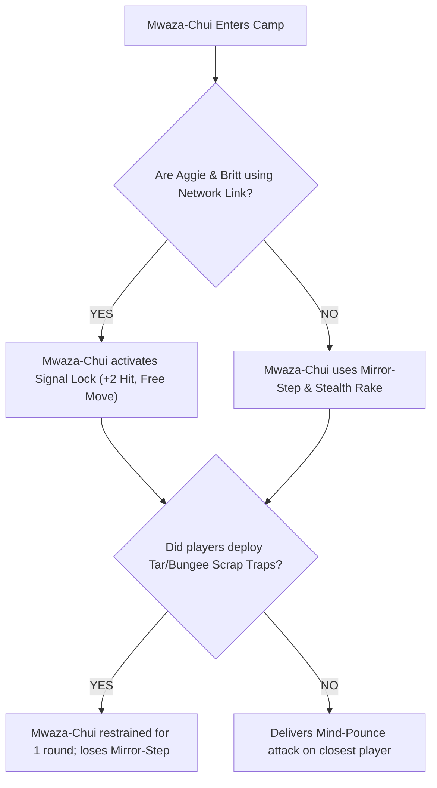

# Session 10 Combat-Ready DM Guide & Stat Blocks

This document provides complete, combat-ready stat blocks, encounter scripts, tactical decision trees, and NPC assistance rules for **Session 10: Survival Instincts & The Aether Beast Breach**.

---

## 👥 Featured NPCs & Squad Connections

| NPC Name | Profile Link | Squad | Role in Session 10 |
| :--- | :--- | :--- | :--- |
| **[[bramble\|Bramble]]** | [bramble.md](file:///d:/Code/vumbua/characters/npcs/bramble.md) | Squad 06 (The Harvesters) | Plant-kin candidate. Distressed by the Aether corruption in Sector 3; calls [[aggie\|Aggie]] via the study net. |
| **[[dr-rose-halloway\|Dr. Rose Halloway]]** | [dr-rose-halloway.md](file:///d:/Code/vumbua/characters/npcs/dr-rose-halloway.md) | Squad 06 (The Harvesters) | Lead researcher trying to collect corrupted flora samples; gets pinned under a floating petrified trunk. |
| **[[pip\|Pip]]** | [pip.md](file:///d:/Code/vumbua/characters/npcs/pip.md) | Independent / Study Group | Small gnome girl riding Bramble's shoulders; uses her truffle-scent instinct to detect hidden stalkers. |
| **[[dee\|Dee]]** | [dee.md](file:///d:/Code/vumbua/characters/npcs/dee.md) | Arena Logistics | Tries to organize emergency skiff evacuations from Zone 0 before the Walker Core shortout cuts communications. |

---

## ⚔️ Encounter 1: Walker Core Collapse & Lightning Stampede
**Location:** Zone 0 (Under the Walker) $\rightarrow$ Zone 8 (Tidal Lands)  
**Objective:** Escape the collapsing perimeter while helping panicked candidates.  
**Threat Level:** Moderate (Environmental Hazard + Stampede)

### DM Read-Aloud Script:
> *"A deep, bone-rattling hum vibrates through your boots as the massive legs of the Walker straddling the shore shudde. High above, the glowing golden sky-ring of the Apex barrier flickers, turns a bruised violet, and splits open with a deafening crack. High-voltage lightning arcs down from the Walker's central resonator, igniting the wet mudflats. Sirens blare across Apex Island, but no teleportation flashes appear. Through the shattered barrier wall, shadow-shapes stream over the ridge!"*

### Phase 1 Mechanics & Action Tracker:
* **Shorted Resonator Lightning Arc (Environment Reaction):** At the start of every GM turn, roll 1d6. On a 5–6, a lightning arc strikes wet ground in Zone 8. Any candidate standing in water or mud must pass a **DC 13 Agility Check** or take **1 Physical Stress** and be knocked Prone.
* **Panicked Crowd (Obstacle):** Candidates from Squad 04 and Squad 08 are fleeing blindly. A candidate can make a **DC 12 Strength or Presence Check** to rally them or clear a path. Failure forces a **DC 12 Instinct Check** to avoid losing 1 held scrap item.

---

## ⚔️ Encounter 2: Rescue at the Petrified Forest Border (Squad 06 Crisis)
**Location:** Zone 1 (Petrified Forest) / Zone 3 (Wetlands Border)  
**Objective:** Save [[bramble\|Bramble]] and [[dr-rose-halloway\|Dr. Rose Halloway]] from a hunting **Gale-Wyrm** and **Stunted Canopy Cats**.  
**Tactical Choice:** Squad 907 receives a frantic audio distress call from Bramble on Kael's prototype study stone:
> *"Aggie! Aggie, can you hear me? The trees... they're screaming! Dr. Rose is trapped under a floating stone trunk, and something with wind-wings is dropping boulders! Please!"*

### Enemies:
* **1x Gale-Wyrm (Apex Aerial Predator)**
* **3x Stunted Canopy Cats (Minion Swarm)**

---

### 🐲 Enemy Stat Block: Gale-Wyrm (Tier 1 Apex)
* **Description:** A 25-foot feathered reptile with translucent aerostatic wings that manipulate local gravity fields.
* **Difficulty:** Tier 1 Solo / Leader
* **HP / Armor Slots:** 5 Armor Slots | **Damage Thresholds:** Minor: 5 | Major: 10 | Severe: 15
* **Attack:** *Aerostatic Talon Strike* (+4 to Hit, Range Close, 2d8+3 Physical Damage)

#### Special Actions & Reactions:
1. 🪨 **Gravity Drop (Action):** The Gale-Wyrm lifts a 1,000-lb floating petrified boulder and hurls it at a zone. All characters in the zone must succeed on a **DC 14 Agility Check** or take **2d10+4 Physical Damage** (Severe threshold) and be pinned (DC 13 Strength to free).
2. 🌪️ **Gravity Reversal Gust (Reaction - Costs 1 Fear):** When targeted by a ranged attack, the Gale-Wyrm flips local gravity. Ranged attacks are made at Disadvantage, and melee attackers without tethering float 15 feet into the air.

---

### 🐱 Enemy Stat Block: Stunted Canopy Cat (Minion Group)
* **Difficulty:** Minion Group (3 Cats)
* **HP / Armor Slots:** 1 HP per Minion (Group of 3)
* **Attack:** *Feral Pounce* (+2 to Hit, 1d6+1 Physical Damage)
* **Mizizi Instinct (Passive):** Gains +2 to Hit against targets pinned by terrain or boulders.

---

### 🪵 Ally Stat Block: [[bramble|Bramble]] (Combat Companion)
* **Role:** Defender & Barrier Support
* **Attack:** *Root Slam* (+3 to Hit, 1d8+2 Physical Damage)
* **Root Wall (Action):** Bramble extends gnarled wooden roots from his arms to create a 10-foot wide cover wall. Characters behind the wall gain **+2 Armor Class / Evasion**.
* **Mizizi Intuition (Passive):** Bramble senses Aether beast movements. While accompanying Squad 907, the squad cannot be surprised by forest-based predators.

---

## ⚔️ Encounter 3: Abyssal Surge & Dagger Shark Pod
**Location:** Zone 4 (The Delta) / Zone 2 (Volcanic Basins)  
**Objective:** Traverse the flooded rapids while dealing with an underwater pressure anomaly.

### DM Read-Aloud Script:
> *"The river channel in Sector 4 has swelled into a boiling torrent. Water surges up through the basalt fissures. Beneath the white-water spray, long silhouetted fins slice through the foam. Suddenly, the water pressure drops to absolute zero — drops of river water hover suspended in mid-air like static rain as a shadow forty feet long passes beneath the breakwater."*

---

### 🦈 Enemy Stat Block: Dagger Shark Pod (3x Minion Group)
* **Difficulty:** Minion Group
* **HP / Armor Slots:** 2 Armor Slots each
* **Attack:** *Razor-Jaw Bite* (+3 to Hit, Range Engagement, 1d8+2 Physical Damage)
* **Pressure Scent (Passive):** If [[iggy\|Iggy]] uses his pressure-push node ability within Close range, Dagger Sharks gain **Advantage** on attack rolls and double their movement speed.

---

### 🐋 Terrain Feature: Leviathan Pressure-Bubble
* **Mechanic:** A passing Aether Leviathan in the deep channel projects a 30-foot **Zero-Pressure Bubble**.
* **Effect:** Inside the bubble, water loses weight and candidates float freely. Physical melee attacks deal half damage, but underwater movement speed is doubled.

---

## ⚔️ Encounter 4: The Apex Stand against the Mwaza-Chui (Memory Jaguar)
**Location:** Squad 907's Fortified Camp (Zone 1 Canopy Ruin or Zone 5 Echo Cave)  
**Objective:** Survive the storm night, defend the camp, and defeat or neutralize the Mwaza-Chui.

---

### 🐆 Boss Stat Block: Mwaza-Chui (Memory Jaguar Apex Boss)

* **Difficulty:** Solo Boss (Tier 1 Apex Stalker)
* **HP / Armor Slots:** 6 Armor Slots | **Damage Thresholds:** Minor: 5 | Major: 11 | Severe: 17
* **Attack 1:** *Aether Rake* (+5 to Hit, Range Engagement, 2d8+4 Physical Damage)
* **Attack 2:** *Mind-Pounce* (+4 to Hit, Range Close, 2d6+3 Mental/Aether Damage; Target must pass DC 13 Instinct or be Stunned for 1 round)

#### Boss Special Actions:
1. 🧠 **Signal Lock (Passive):** Whenever [[britt\|Britt]] or [[aggie\|Aggie]] use their mind-link or network abilities, the Mwaza-Chui gains **+2 to Hit** and immediately moves up to 30 feet toward them without provoking opportunity attacks.
2. 🌫️ **Generational Mirror-Step (Action - 2 Actions):** The Mwaza-Chui becomes semi-translucent, teleporting up to 40 feet to an unlit area or canopy high ground. It leaves behind a glowing Aether decoy (1 Armor Slot to destroy).
3. ⚡ **Memory Surge (Reaction - Triggered on Severe Damage):** The Mwaza-Chui roars, releasing a wave of ancestral Aether. All characters within 20 feet must succeed on a **DC 14 Presence Check** or take **1 Mental Stress** as they experience a flash of the ancient buried Mizizi node.

---

## 🛠️ Combat DM Playbook & Tactical Decision Tree

### Player Scrap Traps & Interventions:
* 🛢️ **Tar Moat:** Restrains the Mwaza-Chui for 1 round; disables *Mirror-Step*.
* 🪢 **Bungee Zipline:** Allows candidates to make a **DC 12 Agility Check** to retreat to high canopy cover out of melee range.
* 🧼 **Sponge Scent Muffler:** Forces the Mwaza-Chui to make Instinct checks at Disadvantage to locate hidden candidates.
* 🤝 **Bramble's Root Barrier:** Absorbs up to 2 attacks from the Mwaza-Chui before splintering.

---

## 📑 Post-Combat Resolution & Narrative Outcomes
* **Victory / Defeat Options:**
  * **Option A (Kill):** The Mwaza-Chui collapses, leaving behind a glowing **Memory-Crystal Core** that Aggie can harvest to learn a clue about the buried Mizizi node.
  * **Option B (Sever Link / Trap):** Aggie and Britt intentionally sever their link or trap the beast in a lead-lined container, causing it to lose interest and retreat into the wild deep borders.
* **Squad 06 Alliance:** If Squad 907 rescued Bramble and Dr. Rose Halloway, Squad 06 pledges their vote and support during the upcoming Captain Selection Phase!
