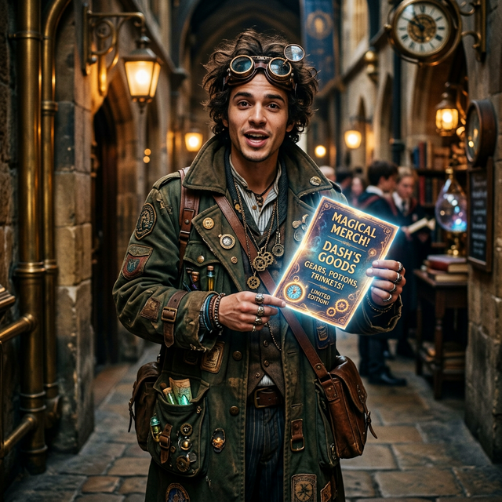

---
tags:
  - npc
canon: gm-plan
reveal: gm
---

# Dash

> *"You got the coin, I got the rr. Don't ask where it came from, just appreciate the craftsmanship."*

## Overview

| | |
|---|---|
| **Role** | Black Market Merchandise Dealer |
| **Faction** | Unknown |
| **First Appearance** | [[s4-plan\|Session 4 Plan]] / Session 5 |

## GM Description
Dash is an eccentric, fast-talking merch dealer student. He has street-smarts out the wazoo, wears an oversized long coat full of hidden pockets, and sports heavy brass goggles.

## Personality
Frantic, excitable, and incredibly focused on commerce. He treats illicit merchandise drops like high-stakes espionage.

## Background
A student who has managed to secure a pipeline for exclusive "rr" (Resonance Race) merchandise. He runs a shadow storefront for students who want to rep their favorite racers but can't afford the official Gear-Shop prices or want restricted items.

## Session Appearances
### Session 4 / 5 Transition
- Interrupts [[Lucky]]'s interrogation of the party by knocking frantically on the door of Lucky's Supply Room.
- Brings word of a new shipment of "rr" merch, causing Lucky to abandon his interrogation.

## Relationships
| Character | Relationship |
|-----------|-------------|
| **[[Lucky]]** | Business partner / distributor. Lucky provides the secure location, Dash provides the goods. |

---

## GM Narration [NOT YET REVEALED TO PLAYERS]

> [!warning]-
> The following information has been narrated by the GM but is not known to the player characters.

[Plot Hook: His merch pipeline might actually be tapping into stolen components from the official racers, risking severe punishment if the Academy finds out.]
