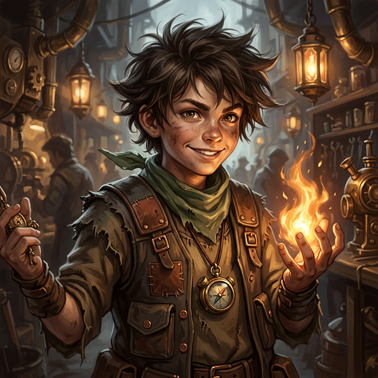

---
tags:
  - npc
  - squad-09
---

# Lucky

| | |
|---|---|
| **Role** | Squad 09 (The Ablative) - Member (Silver Tier) |
| **Affiliation** | [[Vumbua Academy]] |
| **Status** | Active |
| **First Appearance** | [[session-01|Session 1]] |

## Overview
A student in the Silver tier (ranked purely on survival instinct, as he hasn't attended a single class) known for acquiring hard-to-find items. A street-smart hustler who views the Academy as one giant "score" waiting to be cracked.

## Session Appearances

### Session 1
- In the Great Hall exit, approached [[Iggy]]: *"Hey you! I'm Lucky. You need something? You let Lucky know."*
- Sold [[Iggy]] a stolen guard turban as a "Kleenex" for one gold, then bolted before the guard caught up
- Hawked "authentic Ash-Blood" memorabilia: *"That guy's red hot hair? Look at it. Got it right here. Two gold pieces. Hot off the rock."*

### Session 2
- At the Block 99 bonfire, set up in a corner selling **Engine Grease** (moonshine/engine oil)—the drink of choice among boiler room workers
- His pitch: *"Grease your grades or grease your livers!"*
- [[Percival Vane-Smythe III|Percy Vane-Smythe III]] is a regular customer
- [[Sarge]] was watching Lucky disapprovingly from a distance, kicking empty bottles

### Session 5
- Led [[Iggy]], [[Ignatius]], and [[Lomi]] to his "warehouse" (a storage closet) for a "Cards on the Table" negotiation
- Revealed he is tracking people, things, and stories like [[Iggy]] and [[Zephyr]] because they represent a "Big Score" or a ticket out
- Admits to a crush on [[Zephyr]] ("She's electric. No cooties—she just zaps them.")
- Traded an annotated exam guide and Reso Race intel for [[Iggy]]'s clockwork inventions
- Struck a distribution deal with [[Lomi]] for "Ambrosia of Luck" (Engine Grease branding)

## Personality
- **Enterprising Hustler:** If you need it, Lucky can get it (for a price).
- **Survival Instinct:** Relies on the same grit that got him through the Anchorage outskirts and his first disaster.
- **Suspicious/Observant:** Watches for "System Errors" and "Anomalies" like [[Iggy]] and [[Zephyr]].
- **Fearless Salesman:** Pitches to anyone regardless of rank.
- **"The Score" Focused:** Skipping every class to focus on his real objective: getting off the "Ablative" track.
- **Crush:** Smitten with [[Zephyr]]; calls her "electric" and likes that she zaps cooties.

## Timeline: The Hustle and the Hook
For a detailed breakdown of Lucky's journey and his discovery of Iggy's tech, see: [[lucky-timeline|Lucky's Detailed Timeline]].

- **Pre-Academy:** Surviving the Anchorage outskirts after his parents' death in an exploration accident involving [[Sarge]].
- **The Intake:** Pickpocketed a dead candidate's Loom Receipt to get into the Academy.
- **The First Meeting:** Approached [[Iggy]] in the Great Hall. Sold him a stolen guard turban. This wasn't an accident—Lucky saw the "Look" during intake and decided to "invest" early.
- **The Flip:** Took some of [[Iggy]]'s discarded "mechanical junk" (pins and gears) to his city vendor. 
    - **The Reveal:** The vendor LOVED it. Called it "old school"—mechanical power generation over HTech. Wanted all Lucky could get.
    - **The Result:** Lucky got suspicious. Why is "old school" tech more valuable than HTech to a city shark?
- **The Watcher:** Saw [[Zephyr]] taken by [[Dean Isolde Vane|Isolde]]. Recognized the same "lost puppy genius" look. 
- **Current:** Skipping classes, maintaining a Silver rank through raw survival results, and actively looking for more "anomalies." He’s betting his future on [[Iggy]] and [[Zephyr]].

## Source References

- **[[session-01|Session 1]]** — Sold [[Iggy]] a stolen guard turban as a "Kleenex"; hawked Ash-Blood memorabilia *(Scene 7: The Hustle)*
- **[[session-02|Session 2]]** — Selling Engine Grease at the [[Block 99]] bonfire *(Scene 2: Getting Lucky)*
- **[[session-02|Session 2]]** — [[Percival Vane-Smythe III|Percy]] as a regular customer; [[Sarge]] watching disapprovingly *(Scene 2)*
- **[[s5-clean|Session 5]]** — "Cards on the Table" negotiation; trades for inventions; Zephyr crush revealed; "Ambrosia of Luck" grog deal.

---

## GM Narration [NOT YET REVEALED TO PLAYERS]

> [!warning]-
> The following information has been narrated by the GM but is not known to the player characters.

### Backstory
A street urchin from the Anchorage outskirts who pickpocketed a dead candidate's Loom Receipt to get into the intake. He isn't supposed to be here at all. He is an orphan; his parents were killed in a tragic exploration accident that [[Sarge]] was a member of.

### Bond
A younger sister living in the "Low-Bunks" whom he sends his extra rations to.

### Flaw
Pathological Grifter. He cannot stop the "hustle," even when it's counter-productive.

### Motive
To find his "Big Score" and get out. Instead of a comfortable administrative job, he is now focused on finding a way to buy his own ship and escape the "Ablative" cycle entirely. He views the "lost puppy geniuses" as his ticket out.
