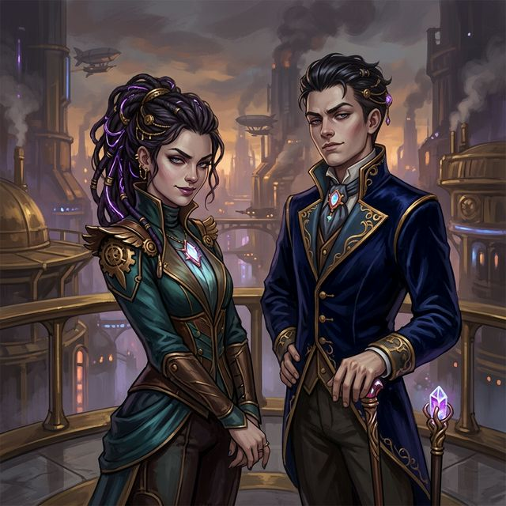

---
aliases:
- Lyra
- Lyra Castellan
tags:
- npc
- student
- castellan-family
- political
---

# Lyra Castellan

> "Val, darling, you look positively frayed. Surely House Sterling isn't working you this hard already?"

| | |
|---|---|
| **Role** | Political Scion / Student / Hanger-on |
| **Affiliation** | Castellan Family, Aspirant to [[House Gilded]] |
| **Status** | Active |
| **First Appearance** | [[session-04.5|Session 4.5]] |

### Daggerheart Stats *(Tier 1)*

| Stat | Mod | | Stat | Mod |
|---|---|---|---|---|
| **Agility** | +0 | | **Instinct** | +0 |
| **Strength** | -1 | | **Presence** | +3 |
| **Finesse** | +1 | | **Knowledge** | +2 |

| Combat Metric | Value |
|---|---|
| **HP** | 6 |
| **Stress** | 5 |
| **Evasion** | 10 |
| **Thresholds** | Minor 4 / Major 8 / Severe 12 |

---

### ⚔️ Adversary Actions

*   **Social Barb (Presence)**: Roll **2d12 + 3** vs. Target's Evasion or Presence. On a success, the target takes **1 Stress** and has **Disadvantage** on their next Presence or Instinct check as Lyra's sharp words cut through their confidence.
*   **Subtle Flattery (Presence)**: Roll **2d12 + 3** vs. Target's Instinct. On a success, the target finds Lyra extremely agreeable. They suffer **Disadvantage** on any rolls to detect her lies or poker face for the rest of the scene.
*   **Century Stare (Fear Cost - 1)**: Lyra locks eyes with a target attempting to bypass or ignore her. The target must roll **Instinct or Presence vs. DC 14**. On a failure, they take **1 Stress** and are rooted in place, unable to approach or pass her for their turn.

---

### 🧠 Skills & Passives

*   **Aggressive Charm**: Once per scene, Lyra can interject herself into a conversation. She grants an ally **Advantage** on a Presence check, or imposes **Disadvantage** on a player's Presence check.
*   **Twin Synergy**: As long as Lyra is within 10 feet of her twin brother [[Ludo Castellan]], they coordinate seamlessly. Both gain **+1 Evasion** and **Advantage** on all social checks (Presence and Knowledge).
*   **Political Instincts**: Lyra has Advantage on checks to identify noble lineages, political affiliations, and social standing of anyone from [[harmony-prime|Harmony Prime]].

---

### 🎒 Equipment & Inventory

*   **Custom Silk Gown (High Fashion)**: Grants her +1 Evasion (included in stats).
*   **Speaking Stone (Pre-recorded)**: A stone containing recorded greetings from minor spire-lords, used to drop names during conversations.
*   **Focus Glass Fan**: Allows her to fan herself while secretly magnifying minor visual details of her targets (+1 to Instinct checks to spot social cues).

## Appearance
A strikingly beautiful young dark-skinned female with rich dark brown skin, severe dark hair tied in a tight bun, wearing a high-collared blue uniform with brass buttons.

## Overview
Lyra is one half of the Castellan twins, a political family from the lower spires that has spent generations clawing their way toward [[House Gilded]] affiliation. She is the designated family heir and the "responsible" one compared to her brother Ludo, bearing the brunt of the expectations to save their family, who are rumored to be on the cliff's edge of their fortune.

## Relationships
- **[[Ludo Castellan]]**: Her twin brother. While she carries the weight of being the heir, they operate as a single social unit.
- **[[Valentine Sterling]]**: Her primary target, though she also harbors a deep, secret childhood crush on him. She aims to marry or associate her family so closely with the Sterlings that their Gilded status becomes undeniable.
- **The Party**: Views them as "interesting clutter" or potential leverage if they continue to associate with Val.

## Personality
- **Aggressively Charming**: She doesn't wait for an invitation to join a conversation; she assumes her presence is the highlight of it.
- **Duty-Bound and Intense**: Underneath her calculating, sharp exterior, there are rare moments where she seems softer and vulnerable. However, she quickly hardens her core to do what her family needs.
- **High Fashion**: Always dressed in the latest Vumbua trends, often slightly more "Gilded" than her actual status allows.

## Session Appearances

### Session 4.5
- **The Sentries:** Glared down the gaggle of students trying to follow Val into his Sterling Hall dorm, giving them a severe "century stare" before slamming the door.

### Session 6
- **Courtroom Wedging:** Blocked Loami's path and wedged him out of the conversation with Val in the courtyard.
- **The Cafeteria Intercept:** Attempted to return to Val's table in the cafeteria to interrupt his discussion with Aggie and Britt, but was physically blocked and stalled by Loami.
- **"The Mushrooms" Comment:** Mocked Val for "talking to the mushrooms" under her breath, which Loami overheard and which prompted Val to leave the cafeteria in frustration.
- **Toast Target:** Hit in the head by a piece of toast thrown by Iggy after insulting the group, causing her to glare daggers at Loami (whom she assumed threw it).

### Session 8
- **Exam Dismissal:** Failed the Exploration 101 written exam. She screamed at Dean Vance and was forcibly escorted out of the stadium grandstands by security.

Based on the details in their notes and the geography of Harmony, here is a look at where Lyra and [[ludo-castellan]] likely hail from and what truly drives them.

### Potential Origins

The Castellans are described as coming from the "lower spires" and having spent generations "clawing their way toward [[house-gilded]] affiliation." This suggests they come from a place where social hierarchy is visible and vertical.

**1. [[harmony-prime|Harmony Prime]] (The Seat)**
- **The Vibe:** As a city of 8 million people and the center of the High Council, this is the most likely home for the Castellans. 
- **The "Lower Spires":** They likely grew up in the literal shadows of the Great Houses. While the elites live in the sun-drenched upper tiers, the Castellans would have lived in the mid-to-lower levels—wealthy enough to see the top, but not high enough to be invited there. Their entire upbringing was likely a lesson in looking upward with envy.

**2. [[Juxta]]**
- **The Vibe:** The source of Lift Stone.
- **The Connection:** Since Lift Stone is what makes the "spires" and mobile cities like [[Vumbua Academy]] possible, the Castellan family might have made their fortune in the logistics or trade of this resource. They provide the literal foundation for the elite to stay "above" everyone else, yet they lack the "Gilded" status themselves. This would create a deep-seated resentment and a drive to finally own the spires they help build.

**3. [[Octo]]**
- **The Vibe:** The communications hub of the empire.
- **The Connection:** This would explain [[ludo-castellan]]'s obsession with information and "Speaking Stones." If the family operated a minor communication relay or a gossip-sheet business in Octo, the twins would have grown up understanding that secrets are the only currency that doesn't devalue.

---

### Their Motives

While they operate as a unit, their individual motives reflect two different ways to "climb" the social ladder.

| Character | Primary Motive | The "Win" Condition |
|---|---|---|
| [[lyra-castellan]] | **Social Integration** | To be so closely tied to [[Valentine Sterling]] that the public cannot distinguish the Castellans from House Sterling. |
| [[ludo-castellan]] | **Information Leverage** | To hold enough "debts" and secrets over the elite that they are forced to grant his family Gilded status to keep him quiet. |

#### 1. The "Gilded" Obsession
For the Castellans, the Academy isn't about learning; it's about the **Receipt**. In Harmony, the receipt is the only proof of status. They are likely under immense pressure from their parents to return from Vumbua with a Gold-tier receipt or a marriage contract. To them, a "Silver" or "Copper" rank isn't just a grade—it's a family catastrophe.

#### 2. The Sterling Key
They view [[Valentine Sterling]] as a "golden key." 
- **Lyra** uses "Aggressive Charm" to create a social vacuum around Val, making herself his most "reliable" companion.
- **Ludo** provides "Academic Solutions," making Val dependent on him for the technical side of Academy life.
- **The Goal:** If they can make themselves indispensable to a Sterling, they effectively "skip the line" of the 80-year stagnation that has kept their family in the lower spires.

#### 3. The "Interesting Clutter" (The Party)
The twins view the rest of the party (like [[Iggy]], [[loami]], or [[Britt]]) as "clutter." Their motive here is **Risk Management**. They want to ensure these "low-rank" associates don't "stain" Val's reputation or, worse, provide Val with a sense of loyalty that doesn't involve the Castellans. If the party becomes too influential, expect the twins to try to "buy" them off or socially isolate them.

---

## GM Secrets

> [!WARNING]- GM Secrets
> - **Childhood Rivalry & Forced Proximity:** Lyra and Ludo have known Valentine since childhood. Their parents forced them to play together to build alliances. However, because their parents' businesses were rivals that competed fiercely despite being forced to collaborate, the twins were never comfortable around Val. 
> - **Secret Crush & Insecurity:** Lyra harbors a deep, unacknowledged crush on Valentine and is fiercely protective of him. However, she is extremely self-conscious about her family's social status and shields herself through arrogance, flawless looks, and intimidation tactics. She carries the heavy burden of her father's massive ambitions on her shoulders.
