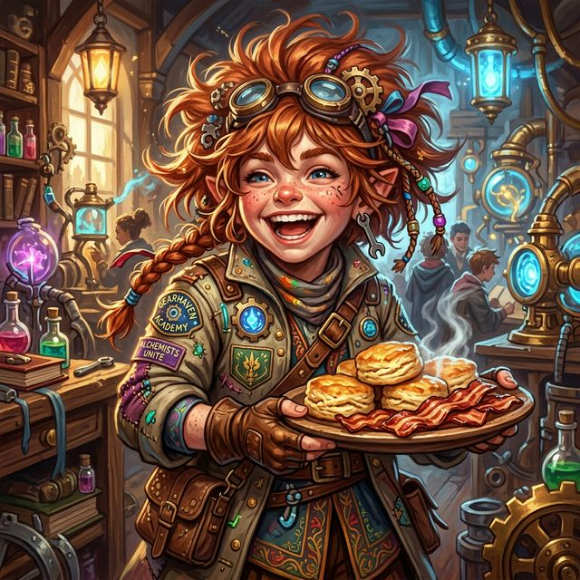

---
tags:
  - npc
  - student
---

# Pip

| | |
|---|---|
| **Role** | Student |
| **Race** | Gnome |
| **Affiliation** | [[Vumbua Academy]] |
| **Status** | Active |
| **First Appearance** | [[s4.5-clean\|Session 4.5]] |

## Overview
Pip is a bubbly, hyperactive gnome student who quickly attached herself to [[Aggie]] and [[Brit]] on the morning before the first day of classes. She’s obsessed with the massive breakfast spreads at the Academy (specifically biscuits, fresh butter, and "dead pigs" / bacon), and she brings an undeniable manic energy to the group.

## Session Appearances

### Session 4.5
- **The Breakfast:** Led Aggie and Brit to the breakfast hall and eagerly devoured multiple plates of food. She excitedly explained what bacon was to Brit, who was horrified.
- **The Chase:** Rode on [[Bramble]]'s shoulders to direct the group chasing after [[Silas Thorne|Professor Thorne]] when he walked out of class.
- **Class:** Fell asleep almost immediately on Bramble's arm during Reality Anchoring class.

### Session 5
- Formed a late-night study group with [[Aggie]] and [[Bramble]] in the courtyard
- Eagerly anticipates the Reso Race for its "networking" potential and the chance to impress captains
- Pressuring Aggie to get [[Valentine Sterling]] to invite them on the airship for the race

### Session 6
- **Airship Pressure:** Urged Aggie in the courtyard to speak with Valentine to get tickets for the Sterling airship.
- **Food Bonding:** Bonded heavily with Iggy in the cafeteria, sharing and trading bites of bacon and biscuits. She had Bramble pour water into her mouth because her hands were full of food.

## Relationships
- **[[Bramble]]:** Her unofficial transport and patient friend. She often rides on his shoulders to see over crowds.
- **[[Kael]]:** Follows him because "he's the smartest of all of us."
- **[[Saffron]]:** Met her before the entrance exams and invited her to join the group.
