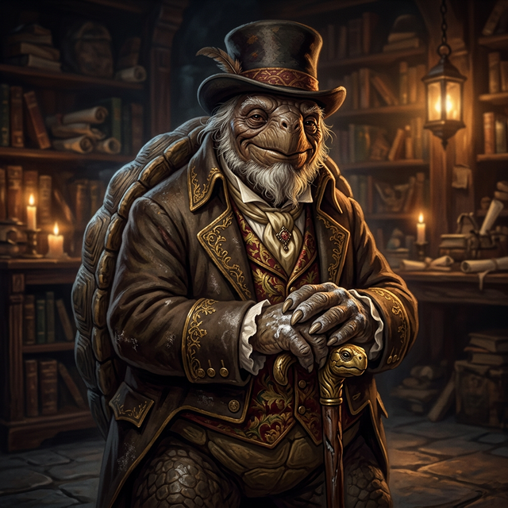

---
aliases:
- Kante
- Professor Kante
tags:
- npc
- faculty
- house-gilded
---

# Professor Kante

> "The numbers do not lie. They simply wait for us to ask the right question."

| | |
|---|---|
| **Role** | Professor of Harmonics |
| **Race** | Tortoise (long-lived) |
| **Affiliation** | [[House Gilded]] (origin), House Vox (research sponsor), [[Vumbua Academy]] |
| **Location** | [[Walker-Core]] — Power Plant, catwalk office |
| **Status** | Active |
| **Accent** | Indian, slow-speaking |
| **First Appearance** | [[session-02.5\|Session 2.5]] |

## Overview

Professor Kante is one of Harmony's foremost researchers in harmonics---the science of ether resonance, [[The Power System|Global Amplitude]] measurement, and battery design. His tortoise lifespan has allowed him to personally oversee the development and release of multiple generations of Vox crystal batteries. He is respected by both [[House Gilded]] (his house of origin) and House Vox (who sponsor his research), a rare bridge between two frequently feuding houses.

He is devoted to his work as a professor and researcher at the Academy, spending his nights taking measurements and filling whiteboards with questions no one else is asking. He wears a top hat and Bridgerton-style outfit.

## What Players Know

**[[Iggy]] only (Session 2.5):**
- Met Kante in the power room late at night — Kante was watching him sketch machinery
- Kante is a tortoise professor of harmonics; slow-speaking, Indian accent, wears a top hat and Bridgerton-style outfit
- He explained the [[The Power System|Global Amplitude]], the Ash-Blood Anomaly, and the Night of Sparks
- His theory: integration works through cultural connection between peoples
- He gave [[Iggy]] an umber crystal and invited him to return for more collaboration
- Iggy mentioned "the Exchange" — Kante had never heard of it
- Kante suspects Iggy is from an isolated, unintegrated sect but didn't push further

*Other players have not met Professor Kante.*

## Source References

- **[[session-02.5|Session 2.5]]** — Met [[Iggy]] in the [[Walker-Core]] power room; explained [[The Power System|Global Amplitude]], the [[Ash-Bloods|Ash-Blood]] Anomaly, and the Night of Sparks *(Scene 4: The Professor)*
- **[[session-02.5|Session 2.5]]** — Gave [[Iggy]] an umber crystal; invited him to collaborate *(Scene 5: The Theory)*
- **[[session-02.5|Session 2.5]]** — Heard about "the Exchange" for the first time from [[Iggy]] *(Scene 5)*

---

## GM Secrets [HIDDEN FROM PLAYERS]

> [!warning]-
> The following information is not known to the player characters.

### The Whiteboard

Kante takes measurements every night. His office whiteboard tells the story of his growing alarm:

- **Historical comparison:** [[The Power System|Global Amplitude]] max line from 50 years vs. 100 years ago (showing the plateau and decline)
- **"Where is the Ash-Blood surge?"** - The central question. A major node integration should have increased the [[The Power System|Global Amplitude]] by +300 to +800 amps. The [[Ash-Bloods]] only produced ~20.
- **Scrapped projections:** The Apex 1 battery line was designed for a post-surge world (Global Amplitude of 900-1400). Those projections sit next to a red "SCRAPPED" note.
- **The storage line question:** "What happens when the Global Amplitude drops below the storage line?" If the amplitude dips below what the Panda line batteries can regulate, power output becomes erratic as the ether field's natural breathing overwhelms the surge protection.

### The Two Problems

1. **The Missing Surge:** The Ash-Blood integration should have been a historic moment---a major node producing the kind of amplitude jump not seen since the Night of Sparks (~400 years ago). Instead, barely a blip. Why?
2. **The Apex 1 Crisis:** His entire next-generation battery line is now useless. All the marketing, all the engineering, all the promises House Vox made to their investors---moot. He doesn't know what to do.

### Relationship with Iggy

Kante will discover [[Iggy]] exploring the power room and recognize a kindred curiosity. He will recruit Iggy to help investigate the missing surge, seeing in the young student a fresh perspective uncontaminated by Harmony's assumptions.

### Personality Notes

- Speaks slowly and deliberately---every word chosen with care
- Has the patience of someone who has lived through centuries of Harmony's history
- Genuinely passionate about the science, not the politics
- Frustrated that House Vox cares more about the Apex 1 marketing failure than the underlying mystery
- Voice: *"What do you like, know?"* — deliberate character voice (do not smooth)

### The Ash-Blood Spire Consultation

Before this year's Circuit-Run, [[Lady Ignis]] submitted formal designs for an **Ash-Blood origin spire** through the Scrivener Guild — the first time an Ash-Blood node would appear in the race. It was to be the cultural debut of her people within Harmony's most public institution.

The Guild brought Kante in to verify the resonance data. He reviewed the ~20 amp anomaly against what the spire's behavior would need to model — and refused to sign off.

**His reasoning:** The Circuit-Run creates a public record. A spire that behaves as-modeled (at 20-amp equivalent output) would be permanently perceived as an underperforming Minor node — even if the real integration value is 300–800 amps as expected. When the correct data is eventually established, there would be a discrepancy between the historical race record and reality. Worse: if the data is never corrected, the inaccurate model becomes canon. Kante will not put a wrong number into a permanent record.

**The pressure:** The Scrivener Guild and senior Academy officials pushed back. Lady Ignis had submitted the design in good faith. The race is the most public moment of the year. The optics of excluding the Ash-Blood debut spire are genuinely bad. Kante was told, in various framings, to *"use what we have."*

He refused. *"I would rather be embarrassed by a gap than wrong by a record."*

**The consequence:** The Ash-Blood terrain is in the arena. Other spires spawn there. But no Ash-Blood origin spire appears — not this season.

**Lady Ignis knows.** She was notified before race day. She has not issued a public statement. Kante does not know what she plans to do with that information.

**His conversation with Sterling (pre-race):** Valentine Sterling came to Kante looking for a story. Kante gave him the Guild line — *"The resonance data isn't finalised."* Sterling tried several angles, including asking about the spire design itself. Kante acknowledged the design was well-considered and said nothing further. Sterling left with more questions than he arrived with. Kante knew that. He did not consider it a problem.
