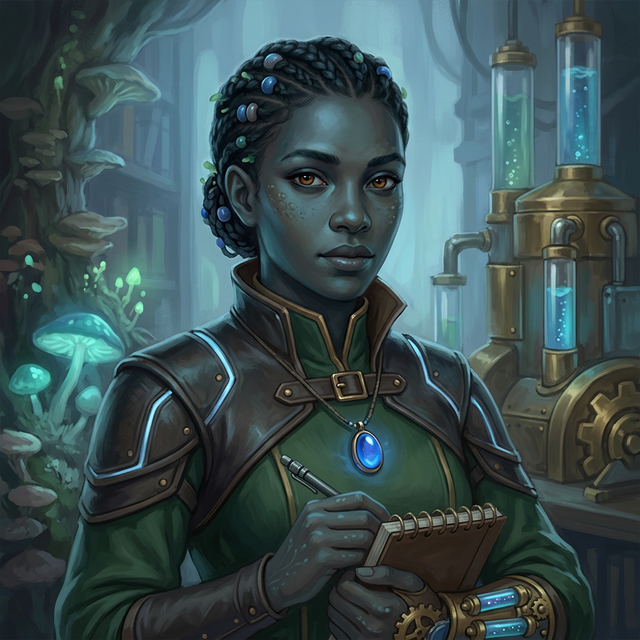

---
aliases:
  - "Real"
  - "The River-Born"
tags:
  - notable-figure
  - npc
  - wadi
---

# Rill (The River-Born)

| | |
|---|---|
| **Aliases** | Real, Rill, The River-Born |
| **Role** | Dean's Assistant / [[Mizizi]] Researcher / "Traitor" / Futurist |
| **Affiliation** | Harmony (Publicly [[Mizizi]], Secretly [[Wadi]]) |
| **Location** | Grass-covered building inset into the hill (near [[Block 99]]) |
| **Status** | Active |
| **Archetype** | The Futurist |
| **First Appearance** | [[session-01\|Session 1]] |

## Overview
Rill is a researcher at [[Vumbua Academy]] who is publicly known as a **[[Mizizi]]** traitor who left the Forest two years ago. **Secretly, she is a [[Wadi]] ([[Wadi|River Clan]])** member who has integrated so perfectly that she passes as Mizizi. She arrived at the Academy **2 months ago** after spending time in the "Silent Zones" between leaving the forest and joining Harmony. [[Serra Vox]] describes her as *"one of the greatest inventors in our age."*

## Session 2 Appearance
Rill appeared on stage during the Dean's Welcome ceremony, pulling [[Dean Isolde Vane|Dean Isolde]] back behind the curtain. She waved good luck to the [[Mizizi]] students ([[Britt]] and [[Aggie]]).

Later at the Block 99 bonfire, Rill appeared after [[Zephyr]]'s lightning incident to retrieve her: *"There you are! We've been looking all over for you."* She bribed Zephyr with hot chocolate and dragged her away.

Before leaving, she recognized [[Britt]] and [[Aggie]] and told them to come find her after class tomorrow, pointing to the grass-covered building inset into the hill.

When [[ignatious]] asked [[Zephyr]]'s name, Rill called back: *"Her name is Zephyr, [[ignatious|Lava Boy]]."*

### Session 5: The Reso Race
- **Team:** Captain of **Team 6: The Silent Drift**.
- **Rig:** **The Reed-Runner** — A minimalist, insectoid walker-glider that uses experimental "Wadi Flow" tech masked as Mizizi bio-resonance. It is designed for stealth and high-precision node-syncing rather than raw speed.
- **Goal:** She is using the race as a high-stakes field test for the navigation systems she needs for her "Silent Run" into the [[mizizi-petrified-forest|Mizizi Petrified Forest]].
- **The Conflict:** She is currently arguing with the Academy's transport crews about the "Vibration Stress" the heavier rigs (like Goliath) are putting on the delicate forest samples in the Basin floor.

## Timeline
- **2 Years Ago:** Left the [[Mizizi]] Forest (The "Traitor" event).
- **2 Months Ago:** Arrived at [[Vumbua Academy]] as a researcher.
- **Session 2:** Appeared at Dean's Welcome and bonfire; managing [[Zephyr]] on Dean's behalf.

## Personality
- **Intelligent, Determined:** She loves the forest, but knows the Elders' "Stagnation" doctrine is suicide.
- **Goal:** Joined Harmony to find a cure for the "Eternal Growth" cancer/data corruption affecting the [[Mizizi]].
- **Connection:** Knows [[Britt]] and [[Aggie]] from her time in the forest. They may not know her true [[Wadi]] nature.
- **The Secret:** Her [[Wadi]] heritage gives her a different perspective on "Flow" and "Stagnation" than a true [[Mizizi]], allowing her to solve problems they cannot.
- Has a familiar relationship with [[Dean Isolde Vane]].
- Manages [[Zephyr]] on behalf of the Dean (knows how to handle her---hot chocolate, patience). However, she is increasingly worried about Zephyr's "resonance leakage."
- Currently working with [[professor-ink|Professor Ink]] on petrified bark analysis, trying to unlock "tree memories."

## Relationships

| Character | Relationship |
|-----------|-------------|
| **[[Dean Isolde Vane]]** | Close working relationship. Rill appears to be her right hand. |
| **[[Zephyr]]** | Manages her on the Dean's behalf. Knows how to bribe/redirect her. |
| **[[Britt]]/[[Aggie]]** | Recognizes them, wants to reconnect after class. |
| **[[Serra Vox]]** | Serra called her "one of the greatest inventors in our age." |
| **The [[Mizizi]] Students** | Waved to them during the Welcome ceremony. |

## Source References

- **[[session-01|Session 1]]** — Pulled [[Dean Isolde Vane|Dean Isolde]] back behind the curtain during the welcome speech; waved to [[Mizizi]] students *(Scene 6: The Dean's Welcome)*
- **[[session-02|Session 2]]** — [[Serra Vox]] identified her as the person who managed the Dean *(Scene 4)*
- **[[session-02|Session 2]]** — Retrieved [[Zephyr]] after the lightning incident; bribed her with hot chocolate *(Scene 4: The Lightning)*
- **[[session-02|Session 2]]** — Invited [[Britt]] and [[Aggie]] to visit her at the grass-covered building *(Scene 4)*
- **[[session-02|Session 2]]** — Called [[ignatious]] "Lava Boy" *(Scene 4)*
