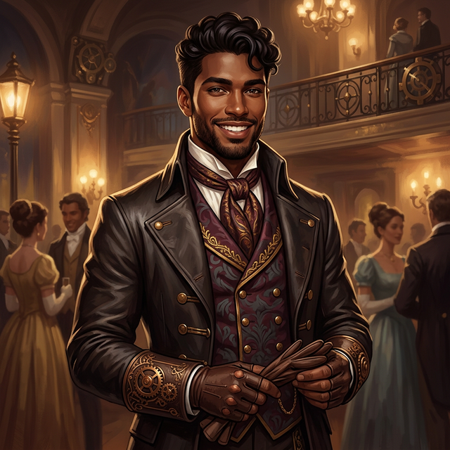

---
aliases:
  - Val
  - Valentine
  - Valentine Sterling
tags:
  - npc
  - student
  - sterling-family
---

# Valentine "Val" Sterling

| | |
|---|---|
| **Role** | Scion of House Sterling / Student Candidate (Gold Rank) / Squad 01 (Prospective) |
| **Affiliation** | [[Vumbua Academy]], [[House Gilded]], House Sterling (Syndicate of Sails) |
| **Status** | Active |
| **First Appearance** | [[session-01|Session 1]] |

### Daggerheart Stats *(Tier 1)*

| Stat | Mod | | Stat | Mod |
|---|---|---|---|---|
| **Agility** | −1 | | **Instinct** | +1 |
| **Strength** | +0 | | **Presence** | +3 |
| **Finesse** | +1 | | **Knowledge** | +2 |

| | |
|---|---|
| **HP** | 6 |
| **Stress** | 5 |
| **Evasion** | 10 |
| **Thresholds** | Minor 4 / Major 8 |
| **Armour** | 0 (he's in a party outfit) |

> **Design notes:** Val is a social powerhouse (+3 Presence) and academically sharp (+2 Knowledge) but physically soft (−1 Agility). He can charm, negotiate, and recall lore, but don't send him into a footrace. His high Stress threshold reflects his unflappable Sterling composure.

## Overview
Valentine is the Scion of House Sterling, son of the legendary explorer [[valentine-sterling-sr|Valentine Sterling Sr.]]. Unlike his cousin [[Valerius Sterling]] (the Radio Host), Val is approachable, charming, and deeply embedded in the social fabric of the Academy, though he struggles with the heavy expectations of his family name.

## Relationships
- **[[valentine-sterling-sr|Valentine Sterling Sr.]]**: His father, the legendary explorer.
- **[[Valerius Sterling]]**: His older cousin and the "Voice of Vumbua" Radio Host.
- **[[ignatious]]**: Met in the courtyard after Intake. Val was amused by the soot/fire but hesitant to touch him.
- **[[Serra Vox|Seraphina Vox]]:** His teammate and fellow noble. He respects her talent but worries about her eccentricities.
- **The Party:** Rivals. He specifically targets them during assessments, but shows a growing willingness to connect with them outside of official channels.

## Session Appearances

### Session 1
- **The Courtyard Encounter:** Met [[ignatious]] immediately after the intake exam.
- **The Handshake:** Hesitated to shake hands ("Will your hand burn me?"), then wiped his hand of soot and stormed off, spitting.

### Session 3
- **The Celestial Lounge:** Hosted the late-night gathering, running parlour games like **Crown & Ruin** and **Truths & Treachery**.
- Sold a practice exam "study guide" to [[Lucky]] to make sure candidates learned the fundamentals.

### Session 4.5
- **The Celebrity:** Spotted trying to escape a gaggle of sycophants in Sterling Hall, using his handlers, the Castellians, to isolate himself in his dorms.

### Session 5
- **The Study Guide:** Clarified that the study guide Val sold was not an "answer key" but a list of hypothesized questions.

### Session 6
- **Potato Mapping:** Found in the cafeteria with his friend [[Jorge]], using hollowed-out potatoes and peas to map the Reso Race track layout.
- **The Pressure:** Confided to Britt and Aggie that he feels immense pressure from his heritage and family name, and dislikes the constant surveillance of his handlers, the Castellians.
- **The Airship Invitation:** Invited the group to board the Sterling family airship (Zephyr) VIP deck one hour before the race to study and watch the race together, promising to help them get down to the stands afterwards.

### Session 7
- **Zephyr Host:** Greeted Iggy at the gangway, anxiously waiting for the party to arrive. Introduced Iggy to the looming glass technology.
- **Engine Room Tour:** Led ignatious, Loami, and Iggy through the Zephyr's engine room after they convinced him it was "applied studying." Explained the resonance power system (DC-current-style wireless energy), the Night of Sparks historical catastrophe, Umbra crystals as resistors, and the Panda 5 battery packs.
- **Global Amplitude Reveal:** Connected Iggy's drunken revelation of Professor Kante's research to the broader problem — the Ash-Blood integration didn't increase global amplitude as predicted, causing next-gen resonators to fluctuate. Noted this is "hush-hush" and that the Castellans are "toast" if the new resonator line fails.
- **Shrewd Observation:** Rolled well enough to notice Loami's deception about the ambassador wanting a refill, but went along with it anyway.
- **The Cram:** After the race, mentioned wanting to squeeze in one last study session before Friday's exam.

## Personality
- **Charismatic:** Naturally open — the kind of person who makes you feel like the most important person in the room.
- **Clean:** Obsessed with appearance (hence the soot reaction), but willing to get "dirty" for a good story.
- **Performative:** Narrates his own life. Light-hearted trash talk is his love language.
- **People over places:** He likes *people* more than exploration. He's a social creature on an explorer's path and privately worries he won't be a great Exploranaut.

---

## GM Secrets

> [!warning]-
> The following information has been narrated by the GM but is not known to the player characters.

### Backstory
Groomed to lead the Venture since birth. He has never actually touched dirt; his magic-treated hands are magically calloused to look "rugged." The Sterling family reputation is a heavy, gilded shield he carries everywhere.

### Flaw
Narcissism. He cannot process the idea of someone being more "efficient" than him.

### The Sterling Secret
Val knows that [[House Gilded]]'s Crystal Banks are running out of reserves. If the Global Amplitude doesn't surge soon, the lights go out — and so does his family's fortune. He treats this knowledge casually in social settings, but it terrifies him.
